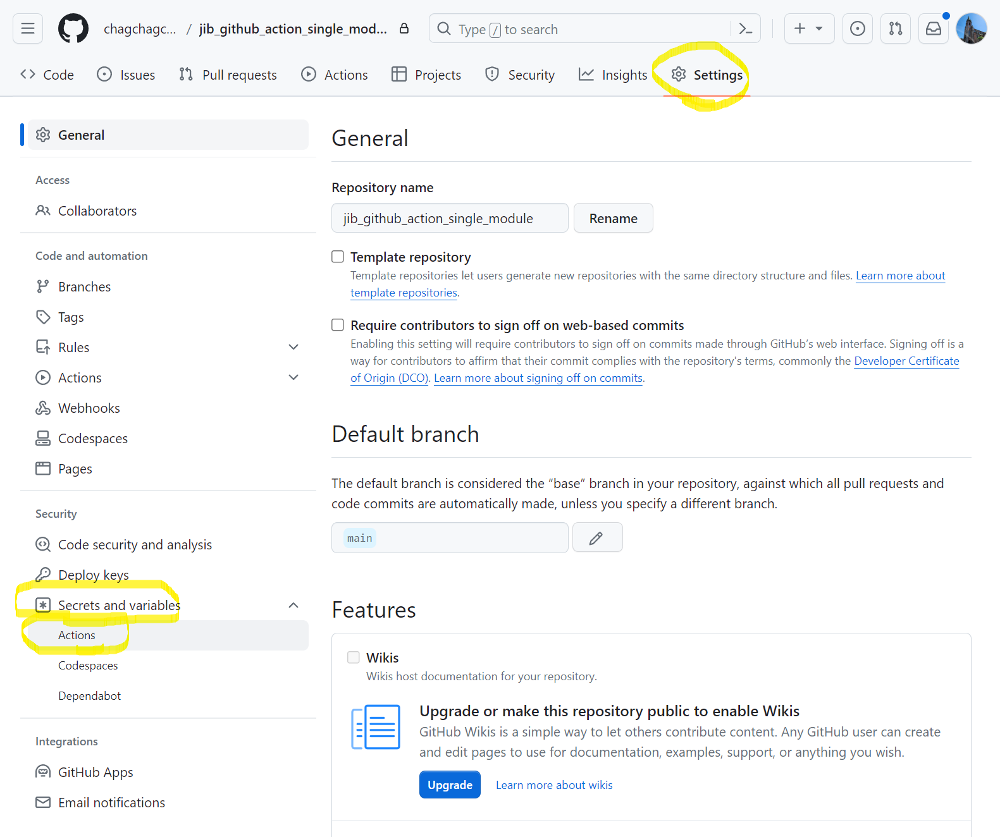
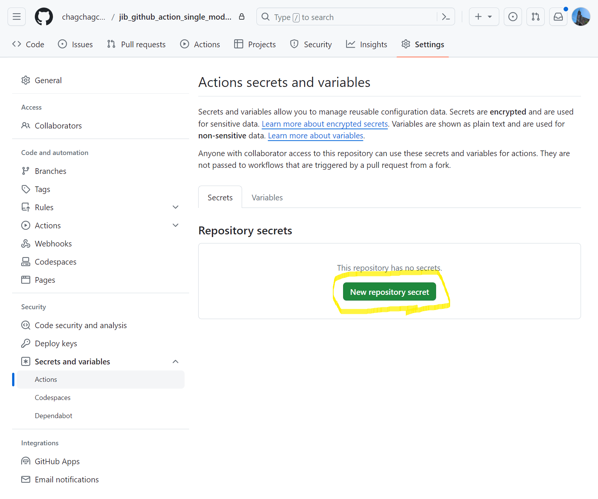
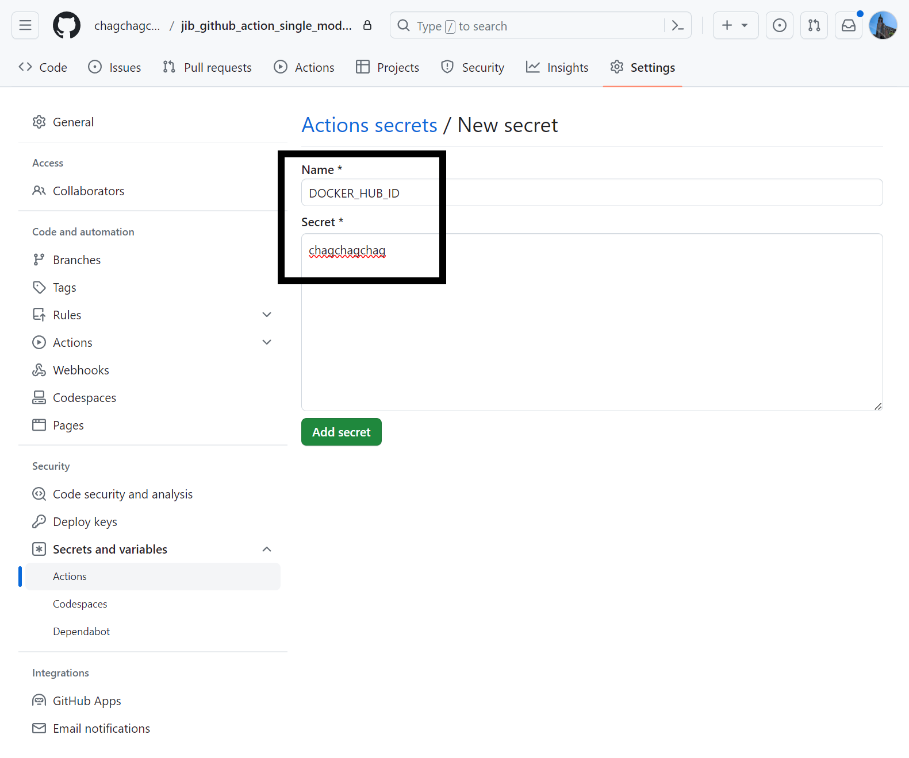
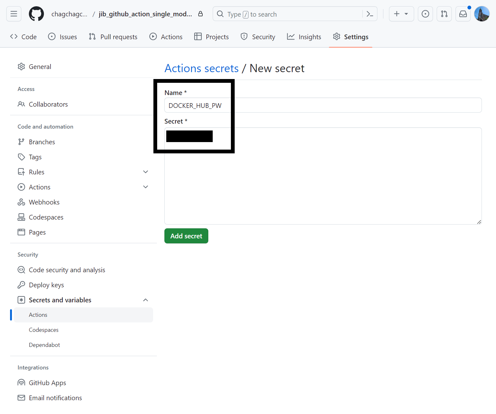
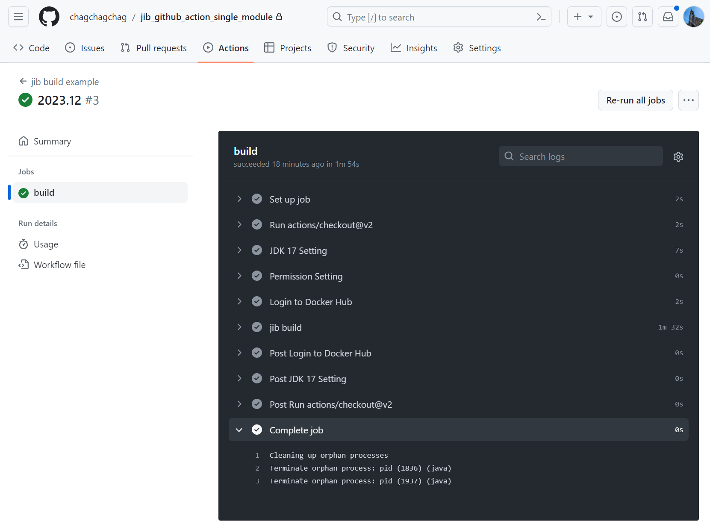

### github actions 에서 secrets 로 환경변수 사용

jib 빌드를 혼자 직접 하기에는 귀찮아져서 ㅋㅋ github actions 빌드스크립트를 작성하는 작업을 진행 중이다. 그러다가 docker hub 를 사용하기 위해서는 secret 이 필요했었다. 그래서 이번 기회에 github 리포지터리 내에서 secrets 를 사용하는 방법을 정리하기로 했다.<br>


### 참고 자료

- [github actions 에서 Secrets 로 환경변수 관리하기](https://velog.io/@2ast/Github-Github-actions%EC%97%90%EC%84%9C-Secrets%EB%A1%9C-%ED%99%98%EA%B2%BD%EB%B3%80%EC%88%98-%EA%B4%80%EB%A6%AC%ED%95%98%EA%B8%B0)

<br>


### 깃헙 리포지터리

- [github.com/chagchagchag/jib\_github\_action\_single\_module](https://github.com/chagchagchag/jib_github_action_single_module)

<br>


### 비공개 데이터를 github action 에서 사용할 때

- Github Repository → Settings → Secrets 활용
- 비공개키 생성
  - 근 시일 내에 keytools 을 이용해서 비대칭키를 만들고 암호화, 복호화를 하는 과정을 정리 예정

위의 두 방식으로 비공개 데이터를 github action 에서 사용할 수 있다. github repository 내에 secrets 에 넣어둘 데이터는 가급적 민감한 정보는 피해야 한다.  ID/PW 같은 민감한 요소들은 사실 비공개키를 기반으로 한 암호화를 해주면 편하다. 이번 예제에서는 github repository 내의 secrets 를 활용하는 예제만을 정리한다.<br>

내가 사이드프로젝트에서 사용하는 DOCKER HUB 가 그렇게 보안적으로 중요하지가 않다. 그 프로젝트 다운받아봐야 쓸 곳이 없기 때문 ㅋㅋ 그래서 오늘 문서에서는 그냥 깃헙 Secret 에 docker hub id, pw 를 저장해서 사용하는 예제만 정리한다. <br>

시간이 된다면, 근 시일 내에  keytool 을 이용해서 암호화하고 복호화 하고 비대칭 키를 만드는 과정으로 예제를 심화시켜서 정리해보려고 한다.

<br>


### github 메뉴에서 secret 생성

원하는 리포지터리 로 이동 → Settings → Secrets and variables → Actions 선택



<br>


New repository secret 버튼 클릭



<br>


docker hub id 를 secret 으로 추가해줬다.



<br>


이번에는 PW 다. 아래와 같이 해줬다.



<br>


### build.gradle.kts 에 jib 빌드 구문 추가

굳이 jib 빌드까지 사용할 필요는 없는데 지금 하고 있는 예제가 따로 있어서 그냥 겸사겸사 build.gradle.kts 의 jib 빌드 구문을 예제로 선택했다.

```kotlin
import org.jetbrains.kotlin.gradle.tasks.KotlinCompile

plugins {
	id("com.google.cloud.tools.jib") version "3.4.0"
	id("org.springframework.boot") version "3.2.0"
	id("io.spring.dependency-management") version "1.1.4"
	kotlin("jvm") version "1.9.20"
	kotlin("plugin.spring") version "1.9.20"
}

group = "com.example.demo"
version = "0.0.1-SNAPSHOT"

java {
	sourceCompatibility = JavaVersion.VERSION_17
}

repositories {
	mavenCentral()
}

dependencies {
	implementation("org.springframework.boot:spring-boot-starter-web")
	implementation("com.fasterxml.jackson.module:jackson-module-kotlin")
	implementation("org.jetbrains.kotlin:kotlin-reflect")
	testImplementation("org.springframework.boot:spring-boot-starter-test")
}

tasks.withType<KotlinCompile> {
	kotlinOptions {
		freeCompilerArgs += "-Xjsr305=strict"
		jvmTarget = "17"
	}
}

tasks.withType<Test> {
	useJUnitPlatform()
}

jib{
	val profile : String = System.getenv("JIB_CONTAINER_PROFILE") as? String ?: "local"

	from {
		image = "amazoncorretto:17"

		// M1 Mac을 사용할 경우 아래 내용을 추가.
//            platforms {
//                platform {
//                    architecture = "arm64"
//                    os = "linux"
//                }
//            }
	}

	to {
		image = "chagchagchag/jib-github-action-single-module"
		// image tag 는 여러개 지정 가능하다.
		tags = setOf("latest")
	}

	container{
		creationTime = "USE_CURRENT_TIMESTAMP"

		environment = mapOf(
			"JIB_CONTAINER_PROFILE" to System.getenv("JIB_CONTAINER_PROFILE"),
		)

		// jvm 옵션
		jvmFlags = listOf(
			"-Dspring.profiles.active=${profile}",
			"-XX:+UseContainerSupport",
			"-XX:+UseG1GC",
			"-verbose:gc",
//            "-XX:+PrintGCDetails",
			"-Dserver.port=8080",
			"-Dfile.encoding=UTF-8",
		)

		// 컨테이너 입장에서 외부로 노출할 포트
		ports = listOf("8080")

		labels = mapOf(
			"maintainer" to "chagachagchag.dev@gmail.com"
		)
	}

	extraDirectories{

	}
}
```

<br>


### `.github/workflows/build.yaml` 추가 

github 액션은 push, pull\_request 가 발생했을 때 트리거 되게끔 지정해줬다.

```yaml
name: jib build example

env:
  JIB_CONTAINER_PROFILE: docker

on:
  push:
    branches:
      - main
  pull_request:
    branches:
      - main

jobs:
  build:
    runs-on: ubuntu-latest
    steps:
      - uses: actions/checkout@v2

      - name: JDK 17 Setting
        uses: actions/setup-java@v1
        with:
          java-version: 1.17

#      - name: Set Environment Variable
#        run: |
#          echo "::set-env name=HELLO_MSG::${{ secrets.HELLO_MSG }}"

      - name: Permission Setting
        run: chmod +x gradlew

      - name: Login to Docker Hub
        uses: docker/login-action@v2.1.0
        with:
          username: ${{ secrets.DOCKER_HUB_ID }}
          password: ${{ secrets.DOCKER_HUB_PW }}

      - name: jib build
        run: ./gradlew jib
```

<br>


### 커밋, 푸시 후에 Github Action 동작 확인

Commit, Push 를 완료한 후에는 아래와 같이 빌드가 트리거 된 화면을 볼수 있다. 정상적으로 빌드 되었음을 확인 가능하다.

