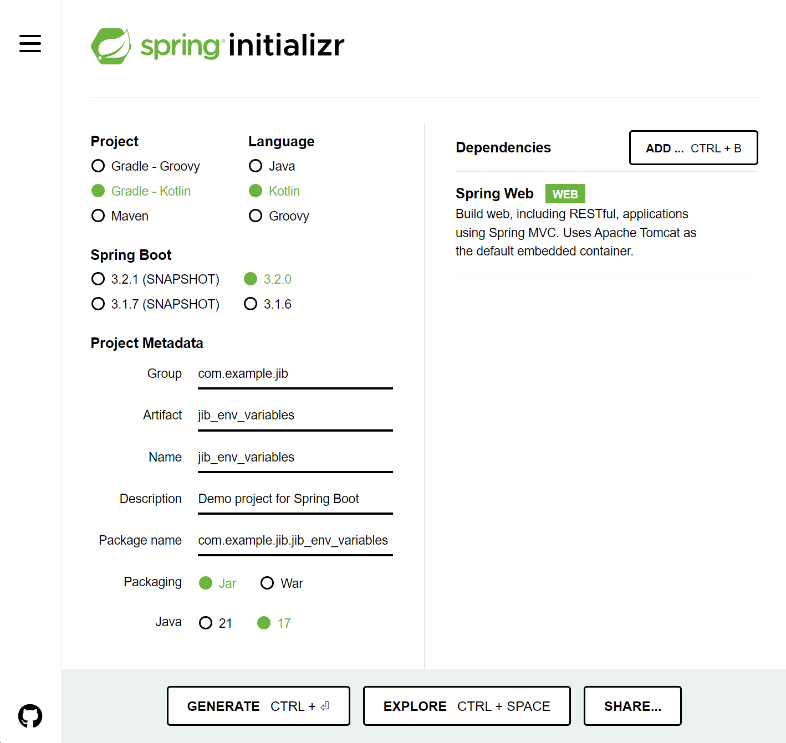
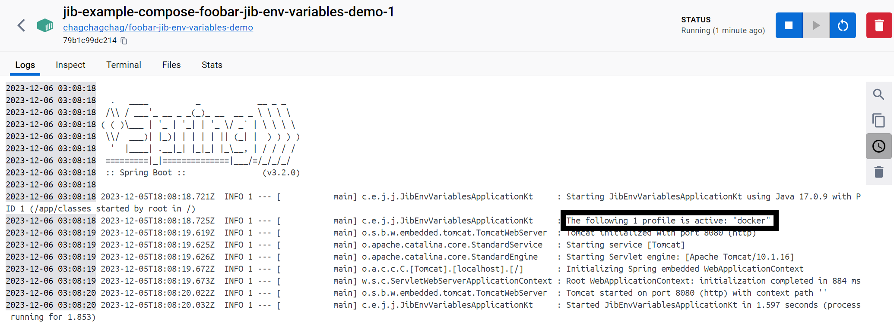

### (docker-jib) docker 이미지 빌드타임에 JVM Option 으로 외부 환경변수 주입 (docker-compose)

이번 문서에서는 일단 docker-compose에 설정했는데, k8s 기반으로 전환하더라도 핵심 키 포인트는 달라지지는 않을 것 같다.<br>

<br>


### 개요

오늘 정리하는 예제는 컨테이너 외부에서 환경변수를 가져와서 자바 환경변수에 주입하는 방식에 대한 예제이다.<br>

예제의 대부분은 https://tangoblog.tistory.com/18 의 내용을 참고했고, 일부분은 수정해서 수행했다.<br>

처음에는 https://tangoblog.tistory.com/18 의 자료를 보고 `어? 이거 괜찮네` 하고 따라서 했다. 글의 요점은 `POD_NAME` 을 컨테이너 내에서 읽어서 JVM 환경변수에 대입하는 것을 이야기하고 있었다. 그런데 이 방식은 컨테이너를 구동시키고 있는 ci 머신에서만 가능하다. 환경변수로 pod\_name 을 넣어둔것이 아닌 이상 Gradle 이 컴파일/빌드 타임에 `POD_NAME` 을 읽어서 자바 환경변수로 넣어주는 것은 불가능하다.<br>

<br>


오늘 정리할 예제의 요점은 이렇다.

- `-Dspring.profiles.active` 를 jib 빌드 시에는 `docker` 로 세팅하도록 하기
- 개발 PC에서 jib 빌드 시에 `-Dspring.profiles.active` 가 적용되어야 한다.
- 일반 `build` 태스크를 기동 시에는  `-Dspring.profiles.active` 가  `local` 로 세팅되어야 한다.

<br>


### 예제 생성

연습용 예제는 아래와 같이 구성했다.



<br>


### build.gradle.kts

설명은 모두 주석에 넣어두었다. `1)`, `2)`, `3)` 에 넣어둔 설명을 참고하자.

```kotlin
import org.jetbrains.kotlin.gradle.tasks.KotlinCompile

plugins {
	//... 
  // 1) 아래 부분을 추가해준다.
	id("com.google.cloud.tools.jib") version "3.4.0"
}

// ...

jib{
  // 2) environment 를 불러온다. 
  // (주의)
  // docker-compose 내에서 정의한 DOCKER_SPRING_PROFILES_ACTIVE 를 불러올 것 같지만 그렇지 않다.
  // 런타임이 아닌 jib 빌드 시에는 jib build 를 수행하는 CI 머신 또는 로컬 개발PC 에 추가해둔 환경변수를 읽어들인다.
	val envProfile : String = System.getenv("DOCKER_SPRING_PROFILES_ACTIVE") as? String ?: "local"

	from {
		image = "amazoncorretto:17"
	}
  
	to {
		image = "chagchagchag/foobar-jib-env-variables-demo"
		tags = setOf("latest")
	}
  
	container {
		creationTime = "USE_CURRENT_TIMESTAMP"

		// jvm 옵션
		jvmFlags = listOf(
      // 3) envProfile 이라는 이름의 환경변수에 대한 값을 주입해준다.
			"-Dspring.profiles.active=${envProfile}",
			"-XX:+UseContainerSupport",
      "-XX:+UseG1GC",
      "-verbose:gc",
      "-XX:+PrintGCDetails",
			"-Dserver.port=8080",
			"-Dfile.encoding=UTF-8",
		)

		// 컨테이너 입장에서 외부로 노출할 포트
		ports = listOf("8080")

		labels = mapOf(
			"maintainer" to "chagachagchag.dev@gmail.com"
		)
	}
}
```

<br>


### docker-compose

오늘 예제에서 docker-compose 는 조연이다ㅎㅎ....<br>

그냥 빌드 되어 있는 도커 이미지를 클론해와서 compose 로 Run 시키는 역할만을 담당한다<br>

먼저 common.yml 이다.<br>


**common.yml**

```yaml
version: '3.7'
```

<br>


**docker-compose.yml**

```yaml
services:
  foobar-jib-env-variables-demo:
    image: chagchagchag/foobar-jib-env-variables-demo
    environment:
    	# 1) `DOCKER_SPRING_PROFILES_ACTIVE` 를 docker 로 지정해줬다.
    	# Gradle Build 시점에는 DOCKER-COMPOSE 의 환경변수가 인식되지 않지만, 
    	# 런타임에는 컨테이너 내에서 읽어들일 수 있다.
      DOCKER_SPRING_PROFILES_ACTIVE: docker
```

<br>


### 환경변수 주입

내 경우는 윈도우 OS를 사용중인데, 윈도우 OS에서 GUI화면을 통해 아래의 환경변수를 세팅해줬다.

```plain
DOCKER_SPRING_PROFILES_ACTIVE=docker
```

맥 OS, 유닉스, 리눅스 등 개발 PC에도 위의 환경변수를 세팅해준다.<br>

아, 물론 개발 PC 에서 빌드해서 docker hub, ecr 같은 docker 이미지 리포지터리에 푸시할 경우에만 해당된다. 만약 젠킨스가 갖춰져 있고 나는 젠킨스에서만 빌드할거야 한다면, 젠킨스 내에 환경변수를 세팅해주면 된다.<br>

<br>


### jib 빌드 수행

프로젝트 루트에서 아래의 명령을 수행한다.

```bash
$ ./gradlew :jibDockerBuild
$ ./gradlew :jib
```

<br>


### docker-compose 구동 후 `-Dspring.profiles.active` 값 확인

```bash
$ docker-compose -f common.yml -f docker-compose.yml up -d
```

<br>


출력결과를 보면 아래와 같이 `-Dspring.profiles.active` 가 `docker` 로 지정되어 있음을 확인 가능하다.



<br>


개발 PC 에 환경변수가 지정되어 있는지, kotlin 코드 내에서 환경변수를 불러올 수 있는지는 아래의 테스트 코드로 확인 가능하다.

```kotlin
package com.example.jib.jib_env_variables

import org.assertj.core.api.Assertions
import org.junit.jupiter.api.Test
import org.springframework.boot.test.context.SpringBootTest

@SpringBootTest
class JibEnvVariablesApplicationTests {

	@Test
	fun contextLoads() {
		// 개발 PC 내에 환경변수가 지정되어 있는지 확인
		println("DOCKER_SPRING_PROFILES_ACTIVE = ${ System.getenv("DOCKER_SPRING_PROFILES_ACTIVE") }")

		Assertions
			.assertThat(System.getenv("DOCKER_SPRING_PROFILES_ACTIVE"))
			.isEqualTo("docker")
	}

}
```

