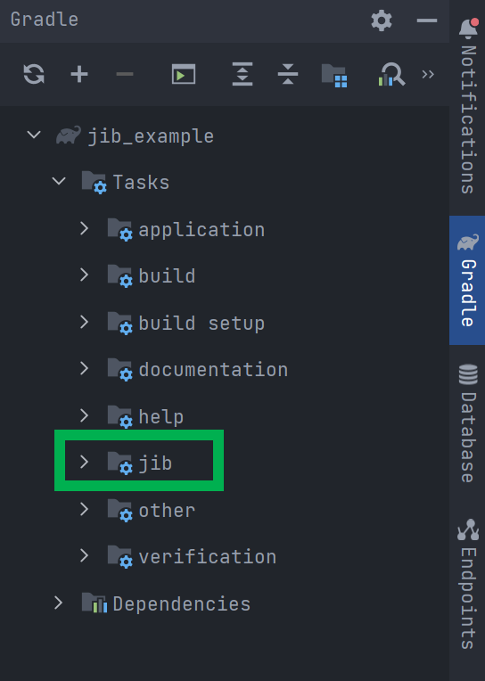
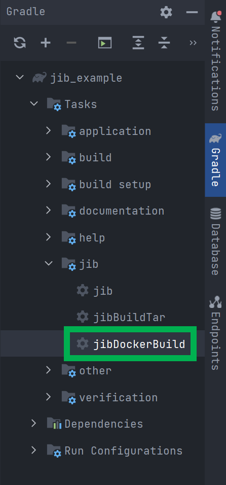
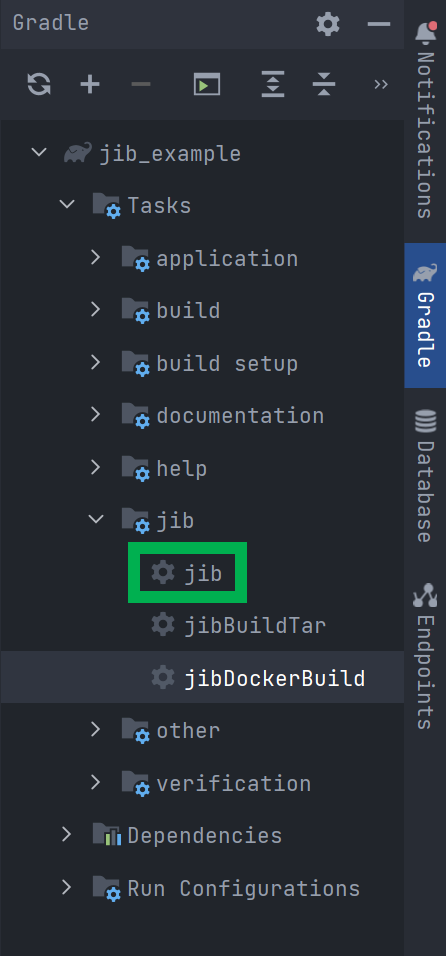
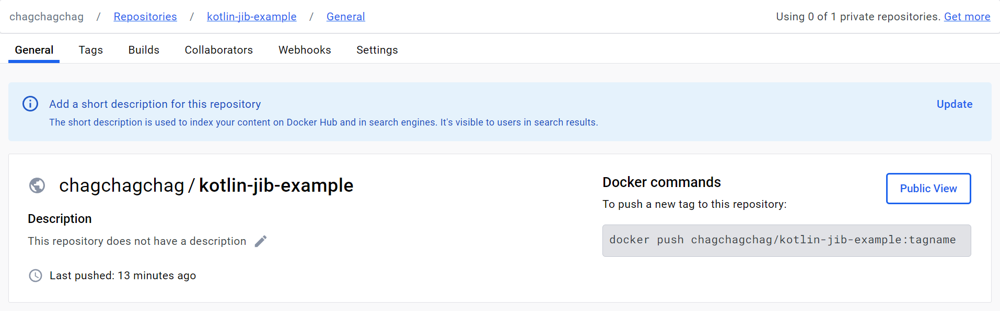

## (docker-jib) kotlin gradle spring boot docker build script 

start.spring.io 에서 web 하나만 추가해서 프로젝트 다운로드해서 아래에 적은 내용들을 따라해보자.

<br>


build.gradle.kts 파일 내의 plugins 에 아래와 같이 `com.google.cloud.tools.jib` 을 추가해준다.

```kotlin
plugins {
  // ...
  id("com.google.cloud.tools.jib") version "3.4.0"
  // ...
}
```

<br>


Gradle Reload 를 하고 나면 아래와 같이 jib 이라는 Task 가 생성된 것을 확인 가능하다.



<br>


이제 jib 스크립트를 작성한다.

build.gradle.kts 에 아래의 내용을 입력한다.

```kotlin
// ...

jib {
	val profile : String = project.findProperty("env") as? String ?: "local"

	// from {} : 애플리케이션을 빌드할 base 이미지
	from {
		image = "amazoncorretto:17"

		// M1 Mac을 사용할 경우 아래 내용을 추가.
//		platforms {
//			platform {
//				architecture = "arm64"
//				os = "linux"
//			}
//		}
	}

	// to {} : 애플리케이션을 빌드할 Target 이미지
	to {
		// 이미지 명 (도커 이미지 명에는 대문자 사용이 불가능하기에 소문자로 지정)
//		image = "chagchagchag/${project.name}-${project.version.toString().lowercase()}"
		image = "chagchagchag/kotlin-jib-example"
		// image tag 는 여러개 지정 가능하다.
		tags = setOf("latest")
	}

	// container{} 빌드된 이미지에서 실행되는 컨테이너
	container{
		creationTime = "USE_CURRENT_TIMESTAMP"

		// jvm 옵션
		jvmFlags = listOf(
			"-Dspring.profiles.active=local",
			"-XX:+UseContainerSupport",
			"-Dserver.port=8080",
			"-Dfile.encoding=UTF-8",
		)

		// 컨테이너 입장에서 외부로 노출할 포트
		ports = listOf("8080")

		labels = mapOf(
			"maintainer" to "chagachagchag.dev@gmail.com"
		)
	}

	// extraDirectories {} : 이미지에 임의의 파일을 추가하는 데 사용되는 디렉터리를 구성
	extraDirectories{

	}
}
```

자세한 설명은 생략.

[github.com/jib/gib-gradle-plugin](https://github.com/GoogleContainerTools/jib/tree/master/jib-gradle-plugin) 에서 자세한 내용을 확인할 수 있다.

<br>


docker 이미지를 빌드하려면 `jib > jibDockerBuild` 태스크를 실행한다.



이렇게 하면 로컬에 도커 이미지가 생성된다.

<br>


이제는 도커 이미지를 도커허브 리포지터리에 푸시해보자.

`jib > jib` 태스크를 실행하면 도커 이미지가 도커 허브 리포지터리로 푸시된다.



<br>


도커 jib 이 docker hub에 푸시된 모습



<br>


**build.gradle.kts**<br>

build.gradle.kts 파일의 전체 내용은 아래와 같다.

```kotlin
import org.jetbrains.kotlin.gradle.tasks.KotlinCompile

plugins {
	id("org.springframework.boot") version "3.1.5"
	id("io.spring.dependency-management") version "1.1.3"
	id("org.asciidoctor.jvm.convert") version "3.3.2"
	id("com.google.cloud.tools.jib") version "3.4.0"
	kotlin("jvm") version "1.8.22"
	kotlin("plugin.spring") version "1.8.22"
}

group = "com.example"
version = "0.0.1-SNAPSHOT"

java {
	sourceCompatibility = JavaVersion.VERSION_17
}

repositories {
	mavenCentral()
}

dependencies {
	implementation("org.springframework.boot:spring-boot-starter-web")
	implementation("com.fasterxml.jackson.module:jackson-module-kotlin")
	implementation("org.jetbrains.kotlin:kotlin-reflect")
	testImplementation("org.springframework.boot:spring-boot-starter-test")
}

tasks.withType<KotlinCompile> {
	kotlinOptions {
		freeCompilerArgs += "-Xjsr305=strict"
		jvmTarget = "17"
	}
}

tasks.withType<Test> {
	useJUnitPlatform()
}

tasks.bootBuildImage {
	builder.set("paketobuildpacks/builder-jammy-base:latest")
}

jib {
	val profile : String = project.findProperty("env") as? String ?: "local"

	// from {} : 애플리케이션을 빌드할 base 이미지
	from {
		image = "amazoncorretto:17"

		// M1 Mac을 사용할 경우 아래 내용을 추가.
//		platforms {
//			platform {
//				architecture = "arm64"
//				os = "linux"
//			}
//		}
	}

	// to {} : 애플리케이션을 빌드할 Target 이미지
	to {
		// 이미지 명 (도커 이미지 명에는 대문자 사용이 불가능하기에 소문자로 지정)
//		image = "chagchagchag/${project.name}-${project.version.toString().lowercase()}"
		image = "chagchagchag/kotlin-jib-example"
		// image tag 는 여러개 지정 가능하다.
		tags = setOf("latest")
	}

	// container{} 빌드된 이미지에서 실행되는 컨테이너
	container{
		creationTime = "USE_CURRENT_TIMESTAMP"

		// jvm 옵션
		jvmFlags = listOf(
			"-Dspring.profiles.active=local",
			"-XX:+UseContainerSupport",
			"-Dserver.port=8080",
			"-Dfile.encoding=UTF-8",
		)

		// 컨테이너 입장에서 외부로 노출할 포트
		ports = listOf("8080")

		labels = mapOf(
			"maintainer" to "chagachagchag.dev@gmail.com"
		)
	}

	// extraDirectories {} : 이미지에 임의의 파일을 추가하는 데 사용되는 디렉터리를 구성
	extraDirectories{

	}
}
```

<br>


너무 오랜만이라 까먹고 있었다. 아이구 두야... Java 로 할 때 jib으로 했었던 예제([java-docker-jib-example](https://hub.docker.com/repository/docker/soongoood/java-docker-jib-example/general)) 가 있는데 왜 기억을 못한거지. 얼마전 채용과정에 코틀린 기반으로 과제를 제출할때 왜 jib으로 도커 이미지를 빌드하지 않았을까 하고 후회를...<br>

설계를 열심히 해서 과제는 통과했지만, 인적성에서 고배를 마셨다. 적성공부도 밤새서 하긴 했는데, 인성검사에서 회사 인재상이랑 다르게 나왔다고 인사팀에서 이메일로 살짝 늬앙스를 추가해서 전달해줬었다.<br>

<br>


