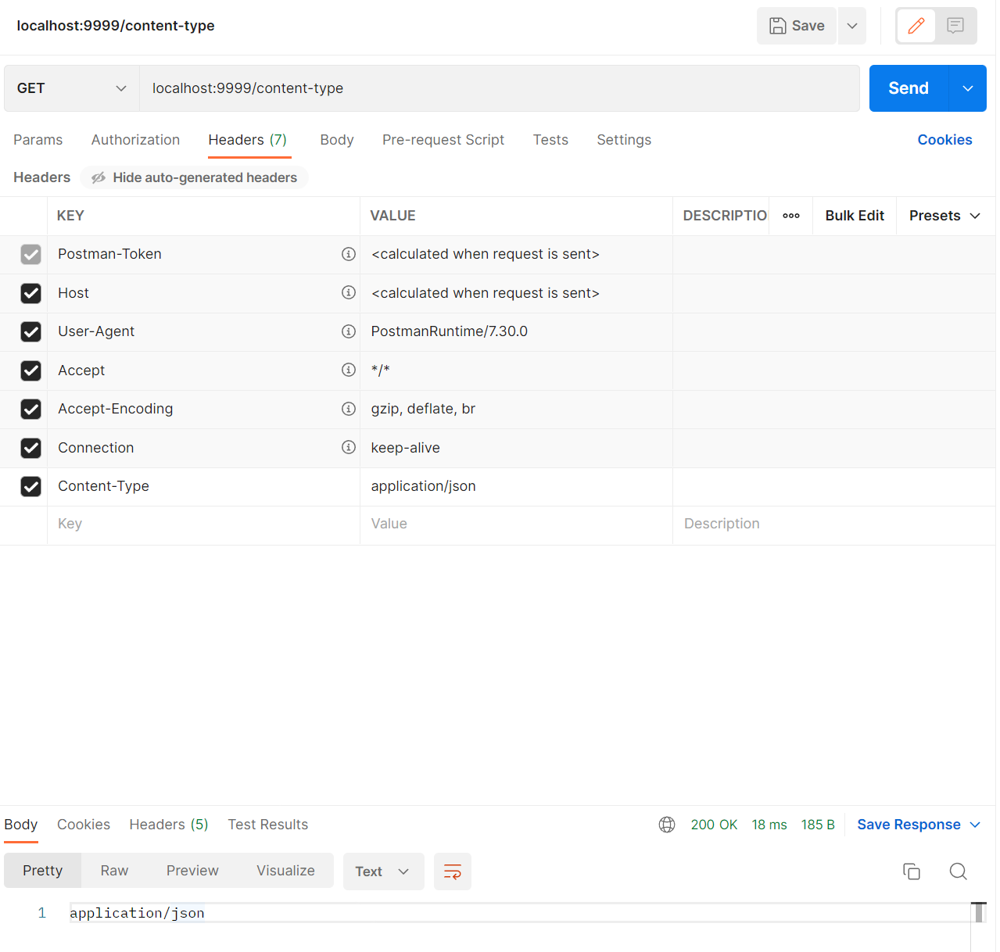
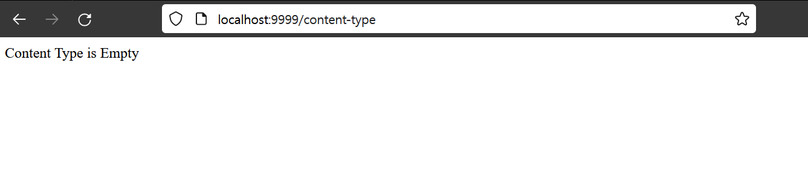

# Content-Type 을 추출하는 ArgumentResolver 

설명을 작성해야 하는데 피곤해서 잠시 스킵.

예제만 먼저 작성해두었는데, 다시 돌아와서 설명을 정리할 예정\~\~\~ !!!;

<br>


### 예제

#### 예제 내용

localhost:8080/content-type 에 요청이 도착하면, 'Content-Type' 이라는 Header가 있는지 조사해서

있다면 'ContentType' 에 대한 Header 값을 Return

없다면 'Content Type is Empty' 라는 문자열을 Return

<br>


#### 커스텀 어노테이션 정의

아규먼트를 조사하는 방법은 여러가지가 있는데, 이번 예제에서는 구현의 편의성을 위해 컨트롤러에 해당어노테이션이 존재하는지를 통해 검사하게끔 예제의 구현을 정의했다.

```kotlin
package io.gosgjung.study.kotlinspringeg1.argument_resolver

@Target(AnnotationTarget.VALUE_PARAMETER)
@Retention(AnnotationRetention.RUNTIME)
annotation class ContentTypeInfo()
```

<br>


#### Controller

/content-type 에 대한 GET 요청을 검사하는 컨트롤러를 구현

```kotlin
package io.gosgjung.study.kotlinspringeg1.argument_resolver

import org.springframework.web.bind.annotation.GetMapping
import org.springframework.web.bind.annotation.RestController

@RestController
class ContentTypeInfoController {

    @GetMapping("/content-type")
    fun getContentTypeInfo(@ContentTypeInfo contentTypeInfo: String) : String{
        return contentTypeInfo
    }

}
```

<br>


#### 커스텀 ArgumentResolver 구현

```kotlin
package io.gosgjung.study.kotlinspringeg1.argument_resolver

import jakarta.servlet.http.HttpServletRequest
import org.springframework.core.MethodParameter
import org.springframework.stereotype.Component
import org.springframework.web.bind.support.WebDataBinderFactory
import org.springframework.web.context.request.NativeWebRequest
import org.springframework.web.method.support.HandlerMethodArgumentResolver
import org.springframework.web.method.support.ModelAndViewContainer

@Component
class ContentTypeArgumentResolver : HandlerMethodArgumentResolver{

    /**
     * 호출되는 Controller 에서 우리가 정의한 어노테이션이 있는지를 검사
     * = 즉, 파라미터를 검사해야 할지 여부를 체크
     */
    override fun supportsParameter(parameter: MethodParameter): Boolean {
        return parameter.getParameterAnnotation(ContentTypeInfo::class.java) != null
                && parameter.parameterType == String::class.java
    }

    /**
     * WebRequest 내에서 Header 에 추가된 'Content-Type' 에 대한 값을 추출하는데 
     * 만약 값이 있다면 해당 헤더에 대한 값을 리턴
     * 만약 값이 없다면 "Content Type is Empty" 라는 문자열을 리턴
     */
    override fun resolveArgument(
        parameter: MethodParameter,
        mavContainer: ModelAndViewContainer?,
        webRequest: NativeWebRequest,
        binderFactory: WebDataBinderFactory?
    ): Any? {
        val req: HttpServletRequest = webRequest.nativeRequest as HttpServletRequest
        return req.getHeader("Content-Type") ?: "Content Type is Empty"
    }

}
```

<br>


#### Config. ArgumentResolver 를 SpringWebMvc의 실행 컨텍스트에 추가

스프링에서는 보통 `Support` 라는 접미사를 붙인 클래스들을 제공해주는 경우가 있는데, 이 `Support` 라는 접미사가 붙은 클래스들은 보통 기본 기능에 확장된 기능들을 제공할 때 사용하는 편이다.

현재 추가하려는 기능은 커스텀하게 작성했던 `ContentTypeArgumentResolver` 인데, 이 것을 스프링 애플리케이션 컨텍스트를 로딩 시에 이 커스텀한 아규먼트 리졸버를 추가하기 위해 아래와 같은 코드를 작성하자.

```kotlin
package io.gosgjung.study.kotlinspringeg1.argument_resolver

import org.springframework.context.annotation.Configuration
import org.springframework.web.method.support.HandlerMethodArgumentResolver
import org.springframework.web.servlet.config.annotation.WebMvcConfigurationSupport

@Configuration
class CustomArgumentResolversConfig (
    val contentTypeArgumentResolver: ContentTypeArgumentResolver
) : WebMvcConfigurationSupport(){

    override fun addArgumentResolvers(argumentResolvers: MutableList<HandlerMethodArgumentResolver>) {
        super.addArgumentResolvers(argumentResolvers)
        argumentResolvers.add(contentTypeArgumentResolver)
    }
}
```

<br>


#### 출력결과

##### Content-Type 이 헤더에 있을 경우



<br>


##### Content-Type 이 헤더에 없을 경우



