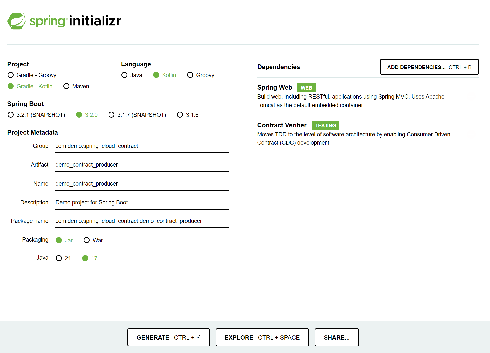

## Spring Cloud Contract Producer 시작해보기

이것 까지 테스트를 직접 해보기에는 시간이 그리 많은건 아닌데 이거 해보느라 조금 시간이 많이 들었다 흐어어..<br>

일단 오늘 해본것들 과정들을 정리!!<br>


Spring Cloud Contract 는 Producer 기반, Consumer 기반으로 테스트해볼 수 있다.<br>

나 역시도 아직은 Spring Cloud Contract 내의 여러가지 기능들에 대해서는 아무것도 알고 있지 않은 상태인데,<br>

일단 예제를 돌려보면 조금씩 파악이 될 것 같아서 직접 예제를 만들어보기를 시작했다.<br>

이번 예제는 Spring Cloud Contract 를 Producer 기반으로 테스트하는 예제다.<br>

다음번 예제로는 Spring Cloud Contract를 Consumer 기반으로 테스트 하는 예제 역시 작성예정<br>

<br>


오늘 문서의 목적은 처음 시작해볼때 어떻게 해야하고 어떤게 안됐었는지를 정리하는것이 목적이다.<br>

언제든지 다시 까먹을 날이 올거라고 생각해서 미래의 나에게 남겨두는 제갈공명의 쪽지 같은 그런개념인듯 ㅋㅋ<br>

<Br>


## 요약

Spring Cloud Contract Producer 를 사용하면 특정 디렉터리에 groovy 기반으로 Contract 를 작성해두고 이 것을 build.gradle.kts 에서 읽어들이도록 지정하고 contractTestClasses 라는 빌드를 수행하면, 이 설정을 기반으로 테스트 코드가 생성된다. <Br>

이때 ComponentScan 이나 AutoConfigure 등과 같은 어노테이션을 미리 지정해둔 클래스가 필요한데, 이 클래스 역시 build.gradle.kts 에 명시해주어서 이것을 테스트 기본설정 클래스로 지정해준다.<br>

사용하는 groovy 클래스는 예를 들면 아래와 같은 모양이다.<br>

<br>


**src/test/resources/contracts/짝수파라미터가\_오면\_짝수를\_리턴한다.groovy**

```groovy
import org.springframework.cloud.contract.spec.Contract

Contract.make {
    description("짝수를 요청하면 짝수를 응답해야함")
    request {
        method GET()
        url("/validate/prime-number"){
            queryParameters {
                parameter("number", "2")
            }
        }
    }
    response {
        body("Even")
        status 200
    }
}
```

<br>


이렇게 작성해둔 groovy 파일을 기반으로 contractTestClasses 태스크를 실행하면 아래와 같은 java 클래스가 생성된다.

```java
// ...

@SuppressWarnings("rawtypes")
public class ContractVerifierTest extends EvenOddContractBaseTestClass {

	@Test
	public void validate_짝수파라미터가_오면_짝수를_리턴한다() throws Exception {
		// given:
			MockMvcRequestSpecification request = given();


		// when:
			ResponseOptions response = given().spec(request)
					.queryParam("number","2")
					.get("/validate/prime-number");

		// then:
			assertThat(response.statusCode()).isEqualTo(200);

		// and:
			String responseBody = response.getBody().asString();
			assertThat(responseBody).isEqualTo("Even");
	}

	@Test
	public void validate_홀수파라미터가_오면_홀수를_리턴한다() throws Exception {
		// given:
			MockMvcRequestSpecification request = given();


		// when:
			ResponseOptions response = given().spec(request)
					.queryParam("number","1")
					.get("/validate/prime-number");

		// then:
			assertThat(response.statusCode()).isEqualTo(200);

		// and:
			String responseBody = response.getBody().asString();
			assertThat(responseBody).isEqualTo("Odd");
	}

}
```

<br>


이렇게 하는 것의 장점은 뭘까?

일일이 모든 Rest Controller 에 대한 MockMvc 테스트 코드를 작성하고, 변경된 것이 있을 때마다 수정하고, 브랜치 병합 때마다 생기는 충돌 등에 대해 일일이 케어하지 않아도 된다는 점이 장점인 듯 싶다. 단순히 groovy 로 작성한 Contract 의 내용만 확인하면 된다는 점은 꽤 편리하다.<br>

다만 RestDocs 와 같은 테스트 기반의 문서는 직접 작성해줘야 한다는 고통스러움은 아직 남아있긴 하다.<br>

<br>


오늘 문서는 굉장히 기초적인 설정이라 세부설정들은 정리해두지 않았다.<br>

<br>


## 참고자료

- [An Intro to Spring Cloud Contract](https://www.baeldung.com/spring-cloud-contract)
- [Spring Cloud Contract 를 배워보자](https://blog.moo-ou.cc/15)

- [github.com/spring-cloud-samples/spring-cloud-contract-samples/producer_kotlin](https://github.com/spring-cloud-samples/spring-cloud-contract-samples/tree/main/producer_kotlin)

<br>


## 예제 코드

- [github.com/chagchagchag/kotlin-study-archive/kotlin/example-code/demo-contract-producer](https://github.com/chagchagchag/kotlin-study-archive/tree/main/kopring/example-code/demo_contract_producer)

<br>


## 의존성

Contract Verifier 를 추가해주면 된다.

```kotlin
// ...

extra["springCloudVersion"] = "2023.0.0-RC1"

dependencies {
	implementation("org.springframework.boot:spring-boot-starter-web")
	implementation("com.fasterxml.jackson.module:jackson-module-kotlin")
	implementation("org.jetbrains.kotlin:kotlin-reflect")
	testImplementation("org.springframework.boot:spring-boot-starter-test")
	testImplementation("org.springframework.cloud:spring-cloud-starter-contract-verifier")
}

dependencyManagement {
	imports {
		mavenBom("org.springframework.cloud:spring-cloud-dependencies:${property("springCloudVersion")}")
	}
}

// ...

```


위와 같이 작성해줬는데, 굳이 외울 필요 없고, start.spring.io 에서 아래와 같이 선택 후에 Explore 버튼을 클릭하면 어떤 내용들이 추가되었는지 보이니까 추가된 내용들을 보고 응용하면 됨!!



<br>


##  Controller

테스트해볼 컨트롤러는 짝수 숫자를 파라미터로 받으면 "Even", 홀수 숫자를 파라미터로 받으면 "Odd" 를 리턴하는 GET 리퀘스트 핸들러를 가지고 있다.

```kotlin
@RestController
class EvenOddController {

    @GetMapping("/validate/prime-number")
    fun isNumberPrime(
        @RequestParam("number") number: Int
    ): String {
        return if (number % 2 == 1)
            "Odd"
        else
            "Even"
    }
}
```

<br>


## Test 설정 코드

Verifier 스캔 코드다.

```kotlin
package com.demo.spring_cloud_contract.demo_contract_producer.contracts

import com.demo.spring_cloud_contract.demo_contract_producer.EvenOddController
import io.restassured.module.mockmvc.RestAssuredMockMvc
import org.junit.jupiter.api.BeforeEach
import org.springframework.beans.factory.annotation.Autowired
import org.springframework.boot.test.context.SpringBootTest
import org.springframework.cloud.contract.verifier.messaging.boot.AutoConfigureMessageVerifier
import org.springframework.test.annotation.DirtiesContext
import org.springframework.test.web.servlet.setup.MockMvcBuilders

@SpringBootTest(webEnvironment = SpringBootTest.WebEnvironment.MOCK)
@DirtiesContext
@AutoConfigureMessageVerifier
class EvenOddContractBaseTestClass {

    @Autowired
    lateinit var evenOddController: EvenOddController

    @BeforeEach
    fun setup(){
        val standaloneMockMvcBuilder =
            MockMvcBuilders.standaloneSetup(evenOddController)

        RestAssuredMockMvc
            .standaloneSetup(standaloneMockMvcBuilder)
    }

}
```


- EvenOddController 를 주입받았다.
- MockMvcBuilders.standaloneSetup 을 통해 Controller를 MockMvcBuilder 객체로 변환해줬다.
- 그리고 이것을 RestAssuredMockMvc 로 변환해줬다.
- 지금 작성한 ContractBaseTestClass 는 build.gradle.kts 에 contracts {... } 에 클래스의 패키지명을 포함한 전체 경로를 명시해주면 contracts 태스크 실행시 ContractBaseTestClass 기반으로 테스트가 실행된다.

<br>


## build.gradle.kts - Task 작성

baseClassForTests 프로퍼티에 대한 값으로 위에서 작성한 Test 설정 코드 클래스의 **"패키지 경로 + 클래스 명"**을 명시해준다.

```kotlin
// ...

contracts {
	contractsDslDir = file("/src/test/resources/contracts")
  baseClassForTests.set("com.demo.spring_cloud_contract.demo_contract_producer.contracts.EvenOddContractBaseTestClass")
}

// ... 
```

<br>


## build

clean → contractTestClasses → build 순으로 빌드해준다.<br>

또는 clean → build 를 해준다.<br>

<br>


## 생성된 테스트 케이스 확인

/build/generated-test-sources/contractTest/java/com.demo.spring\_cloud\_contract.demo\_contract\_producer.contracts 패키지 아래에 아래와 같은 코드가 생성된다.

```java
package com.demo.spring_cloud_contract.demo_contract_producer.contracts;

import com.demo.spring_cloud_contract.demo_contract_producer.contracts.EvenOddContractBaseTestClass;
import org.junit.jupiter.api.Test;
import org.junit.jupiter.api.extension.ExtendWith;
import io.restassured.module.mockmvc.specification.MockMvcRequestSpecification;
import io.restassured.response.ResponseOptions;

import static org.springframework.cloud.contract.verifier.assertion.SpringCloudContractAssertions.assertThat;
import static org.springframework.cloud.contract.verifier.util.ContractVerifierUtil.*;
import static io.restassured.module.mockmvc.RestAssuredMockMvc.*;

@SuppressWarnings("rawtypes")
public class ContractVerifierTest extends EvenOddContractBaseTestClass {

	@Test
	public void validate_짝수파라미터가_오면_짝수를_리턴한다() throws Exception {
		// given:
			MockMvcRequestSpecification request = given();


		// when:
			ResponseOptions response = given().spec(request)
					.queryParam("number","2")
					.get("/validate/prime-number");

		// then:
			assertThat(response.statusCode()).isEqualTo(200);

		// and:
			String responseBody = response.getBody().asString();
			assertThat(responseBody).isEqualTo("Even");
	}

	@Test
	public void validate_홀수파라미터가_오면_홀수를_리턴한다() throws Exception {
		// given:
			MockMvcRequestSpecification request = given();


		// when:
			ResponseOptions response = given().spec(request)
					.queryParam("number","1")
					.get("/validate/prime-number");

		// then:
			assertThat(response.statusCode()).isEqualTo(200);

		// and:
			String responseBody = response.getBody().asString();
			assertThat(responseBody).isEqualTo("Odd");
	}

}
```


