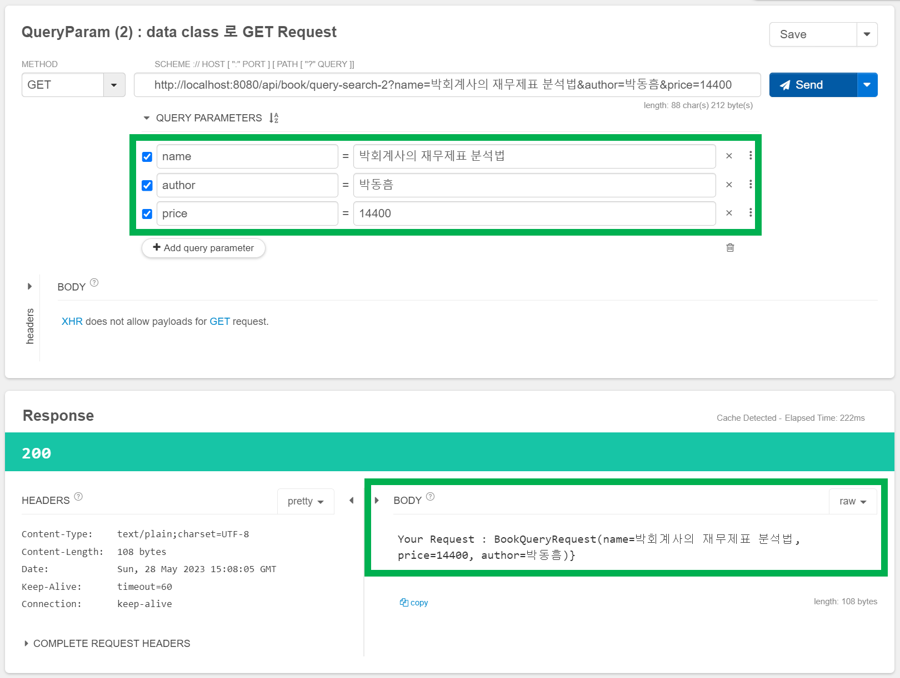
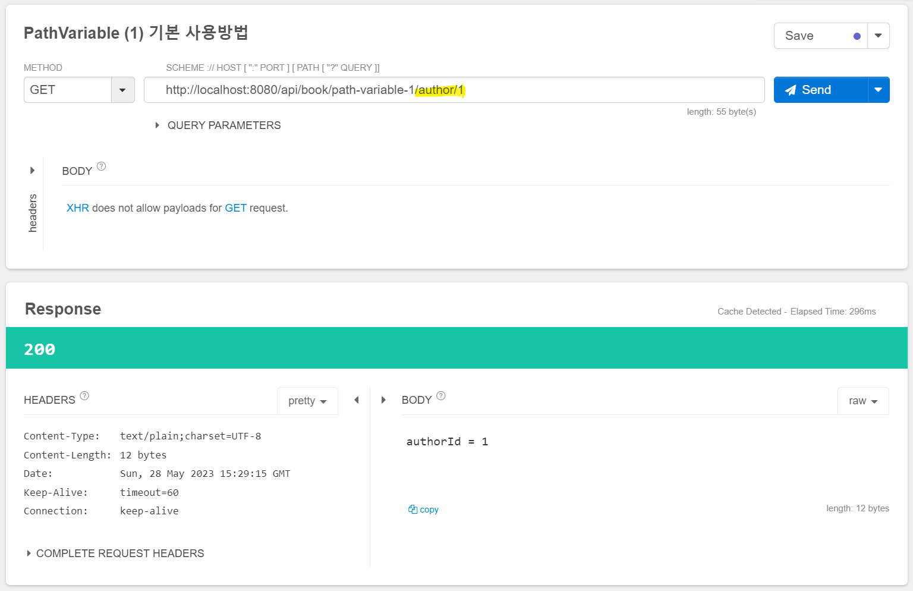
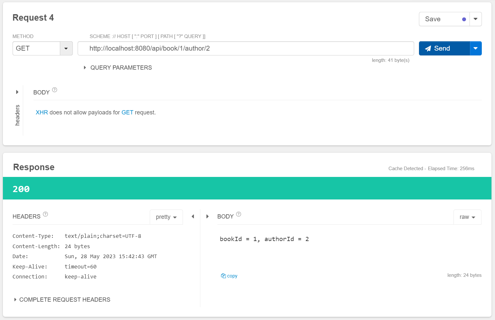

# QueryParam, PathVariable


### QueryParam

#### @RequestParam

아래와 같이 파라미터를 받는 경우를 생각해보자.

```kotlin
@GetMapping("/api/book/query-search-1")
fun querySearch1(
    @RequestParam(name = "name") name: String?, 
    @RequestParam(value = "age") author: String): String {
    return "Your Request : { name = ${name}, author = ${author}}"
}
```

<br>

##### @RequestParam (name = ""), @RequestParam(value = "")

이때 아래 두 표현식은 같은 표현이다.

```kotlin
@RequestParam(name = "name") name: String?
// 위의 표현식과 아래 표현식은 같은 의미다.
@RequestParam(value = "name") name: String?
```

<br>


##### required=true 가 기본값

RequestParam 은 required=true 가 기본값이다. required=true는 파라미터가 필수로 필요하다는 필수 옵션인데, 필수 파라미터가 아닌 옵셔널한 값으로 수정하려면 required=false 로 지정해주면 된다.

<br>


#### data class 로 GET QueryParam 을 묶어서 받기

일일이 모든 파라미터를 개별 필드로 받기에는 쉽지 않을수도 있다. QueryParam 은 스프링에서 class 단위로 파라미터를 묶어서 받는 것이 가능하다. (내부적으로는 ArgumentResolver 등의 동작을 통해 클래스로 변환해줌)

```kotlin
data class BookQueryRequest (
        var name: String? = null,
        var price: BigDecimal? = BigDecimal.ZERO,
        var author: String? = null,
){
}
```

<br>


위에서 선언한 `BookQueryRequest` 클래스로 QueryParam을 받을 수 있다.

```kotlin
@GetMapping("/api/book/query-search-2")
fun querySearch2(bookQueryRequest: BookQueryRequest): String{
    return "Your Request : ${bookQueryRequest}}"
}
```

<br>


이렇게 작성한 GET 리퀘스트는 아래와 같이 요청을 보내면 정상적으로 잘 처리되는 것을 확인할 수 있다.



<br>


### PathVariable

#### 기본적인 형식

PathVariable 은 기본적으로 아래와 같은 형태로 작성한다.

```kotlin
@GetMapping("/api/book/path-variable-1/author/{authorId}")
fun pathVariable1(@PathVariable authorId: Long): String{
    return "authorId = ${authorId}"
}
```

<br>


조회 결과



<br>


#### 파라미터 변수명을 변경하여 요청 처리

애플리케이션의 요청을 처리하는 REST API 를 작성하다보면, 사용될 특정 파라미터 명이 언어에서 예약된 키워드일 수 도 있고, 변수명을 다르게 사용해야 할 때도 있다. 

이런 경우 아래와 같이 @PathVariable 내의 value 또는 name 파라미터를 따로 지정해주면 된다.

@PathVariable 내에 사용한 파라미터 `value` , `name` 는 모두 같은 역할이다.

> api 주소가 꽤 이상한 형식이긴 하지만, 예제를 위해 조금 억지로 **지어내봤음**

```kotlin
@GetMapping("/api/book/{bookId}/author/{authorId}")
fun pathVariable2(ㅜ
        @PathVariable(name = "bookId") _bookId: Long,
        @PathVariable(value = "authorId") _authorId: Long,
): String{
    return "bookId = ${_bookId}, authorId = ${_authorId}"
}
```

<br>


조회결과



<br>


