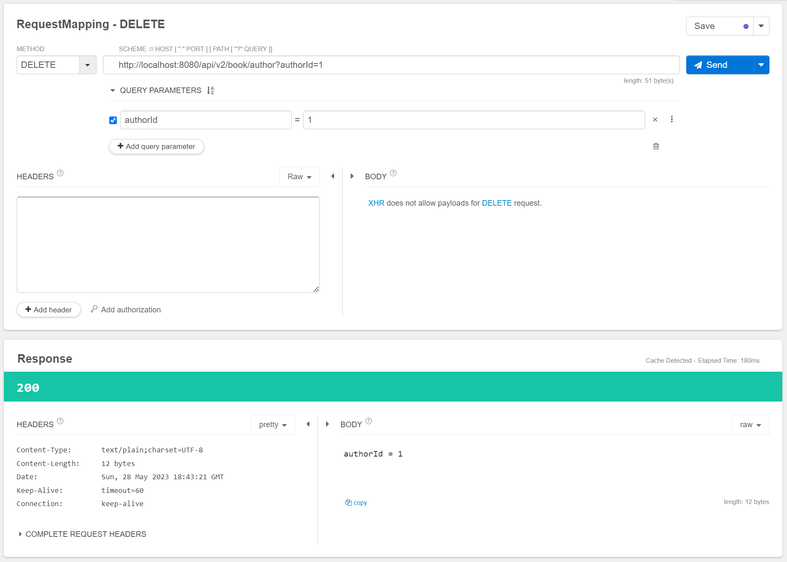

# RequestMapping, GetMapping

그냥... 정리해봄.ㅎㅎ

<br>


### RequestMapping

RequestMapping 은 GET, POST, PUT, DELETE 등과 같은 method 와 관계없이 사용 가능하다.

```kotlin
@RestController
@RequestMapping("/api/v2/book")
class BookApiV2Controller{
    // ...
}
```

<br>


만약 위와 같이 작성하면, BookApiController 내에 작성하는 @GetMapping 등과 같은 REST API 들의 앞에는 "/api/v2/book" 이 붙는다.

<br>

스프링 부트 이전에는 아래와 같이 @RequestMapping 어노테이션에 파라미터들을 세부적으로 지정해서 URL 들을 매핑하기도 했다.

(물론, 스프링부트에서도 사용가능)

e.g. GET http://localhost:8080/api/v2/book/author

```kotlin
@RestController
@RequestMapping("/api/v2/book")
class BookApiV2Controller {
    
    // ... 

    @RequestMapping(method = [RequestMethod.GET], path = ["/author"])
    fun getAuthor(): String{
        return "string"
    }

}
```

<br>


e.g. POST http://localhost:8080/api/v2/book/author

```kotlin
@RestController
@RequestMapping("/api/v2/book")
class BookApiV2Controller {
    
    // ... 

    @RequestMapping(method = [RequestMethod.POST], path = ["/author"])
    fun postAuthor(@RequestBody bookAddRequest: BookAddRequest): String{
        return "request = ${bookAddRequest}"
    }

}
```

<br>


조회결과


<br>


e.g. PUT http://localhost:8080/api/v2/book/author

```kotlin
package io.study.kopring.simple_app.book.controller

import io.study.kopring.simple_app.book.model.BookAddRequest
import io.study.kopring.simple_app.book.model.BookDeleteRequest
import io.study.kopring.simple_app.book.model.BookModifyRequest
import org.springframework.web.bind.annotation.RequestBody
import org.springframework.web.bind.annotation.RequestMapping
import org.springframework.web.bind.annotation.RequestMethod
import org.springframework.web.bind.annotation.RestController

@RestController
@RequestMapping("/api/v2/book")
class BookApiV2Controller {
    
    // ...
    
    @RequestMapping(method = [RequestMethod.PUT], path = ["/author"])
    fun putAuthor(@RequestBody bookModifyRequest: BookModifyRequest): String{
        return "request = ${bookModifyRequest}"
    }

}
```

<br>


조회결과


<br>


e.g. DELETE http://localhost:8080/api/v2/book/author

```kotlin
@RestController
@RequestMapping("/api/v2/book")
class BookApiV2Controller {

    // ...
    
    @RequestMapping(method = [RequestMethod.DELETE], path = ["/author"])
    fun deleteAuthor(authorId: Long): String{
        return "authorId = $authorId"
    }

}
```

<br>


조회결과



<br>


### GetMapping

> - http://localhost:8080/api/v1/book/1
> - http://localhost:8080/api/v1/author/detail/1
> - http://localhost:8080/api/v1/author/info/1

<br>


```kotlin
@RestController
@RequestMapping("/api/v1/author")
class AuthorApiV1Controller {

    @GetMapping(path = ["/{authorId}", "/detail/{authorId}", "/info/{authorId}"])
    fun getDetail(): String{
        return "피터린치"
    }
    
	// ...
    
}
```

<br>

`@GetMapping(path = ["/{authorId}", "/detail/{authorId}", "/info/{authorId}"])` 처럼 여러개의 API 에 매핑할수도 있다.

<br>


### PostMapping

> - http://localhost:8080/api/v1/author
> - http://localhost:8080/api/v1/author/add
>
> ```
> {
> 	"name": "피터린치",
> 	"authorId": 1
> }
> ```

<br>


```kotlin
@RestController
@RequestMapping("/api/v1/author")
class AuthorApiV1Controller {
    
    // ...
    
    @PostMapping(path = ["", "/add"])
    fun postAuthor(
            @RequestBody authorAddRequest: AuthorAddRequest
    ): String{
        return "request = $authorAddRequest"
    }

    // ...
    
}
```

<br>


### PutMapping

> - http://localhost:8080/api/v1/author
> - http://localhost:8080/api/v1/author/modify
>
> ```
> {
> 	"name": "피터린치",
> 	"authorId": 1
> }
> ```

<br>


- @RequestBody 에 대한 내용이 없으면 생성
- @RequestBody 에 대한 내용이 있으면 수정 

<br>


> PUT, POST 의 차이점은 아래의 자료들을 참고하자. PUT 의 경우 멱등성을 위한 연산에 자주 쓰이는데, 흔히 알려진 자원의 UPSERT 같은 행위 말고도 항상 동일한 결과를 내야 할 경우 PUT 을 어떤 자원에 대한 멱등성을 보장하는 특정 행위에 대한 표현으로 사용하기도 한다.
>
> - [PUT](https://developer.mozilla.org/ko/docs/Web/HTTP/Methods/PUT)
> - [POST](https://developer.mozilla.org/ko/docs/Web/HTTP/Methods/POST)

<br>


```kotlin
@RestController
@RequestMapping("/api/v1/author")
class AuthorApiV1Controller {

    // ...
    
    @PutMapping(path = ["/", "/modify"])
    fun modifyAuthor(
            @RequestBody authorModifyRequest: AuthorModifyRequest
    ): String{
        return "request = $authorModifyRequest"
    }
    
    // ...
    
}
```

<br>


### DeleteMapping

> http://localhost:8080/api/v1/author?name="피터린치"&authorId=1

<br>


```kotlin
@RestController
@RequestMapping("/api/v1/author")
class AuthorApiV1Controller {
	
    // ...
    
    @DeleteMapping(path = ["", "/delete"])
    fun deleteAuthor(
            authorDeleteRequest: AuthorDeleteRequest
    ): String{
        return "request = $authorDeleteRequest"
    }
}
```

<br>

