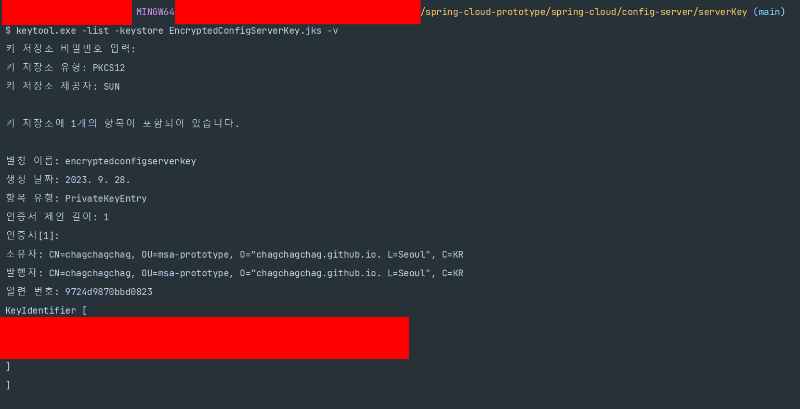
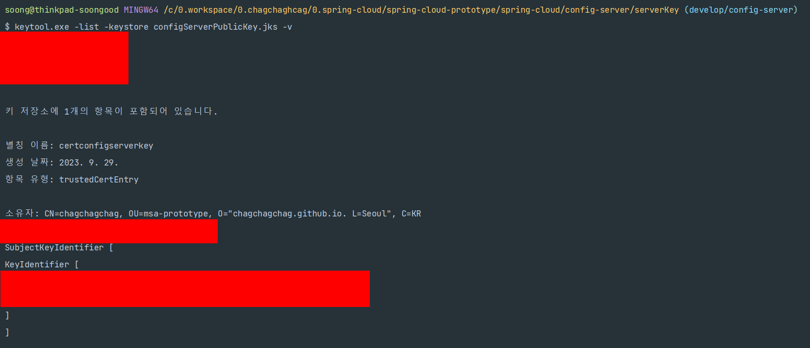
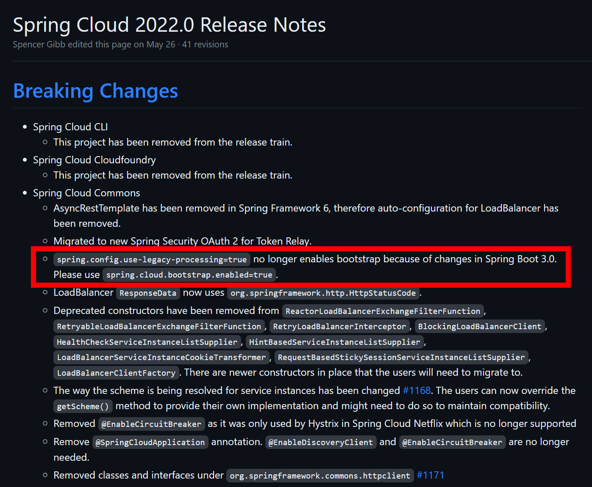

### 비대칭키 기반 Spring Cloud Config Server 구축 가이드 (Spring Boot 3.1.x)

> 이번에도 역시... 혼자 만들어보는 예제에서 `가이드` 라는 말을 쓰는게 어찌나 오글거리든지 ㅋㅋ 일단 제목을 뭘로 할지 몰라서 그냥 구축 가이드라고 적었다.

### Summary 

- JAVA 의 keytool 을 활용해서 public key, private key 를 생성한다.

- 생성된 key 파일은 `{원하는 디렉터리}/serverKey/` 에 저장한다.


keytool 명령어는 아래와 같은 모양이다.

```bash
keytool -genkeypair -alias EncryptedConfigServerKey -keyalg RSA -dname "CN=chagchagchag, OU=msa-prototype, O=chagchagchag.github.io, L=Seoul, C=KR" -keypass "asdf1234" -keystore EncryptedConfigServerKey.jks -storepass "asdf1234"
```


- CN : Company Name
- OU : Organization Unit
- o : organization
- L : Location
- C : Country 
- alias : alias 는 혼동을 피하고자 키파일과 같은 이름을 주었다. (`EncryptedConfigServerKey`)

<br>


RSA

공개키 암호화 알고리즘 

<br>


### 생성파일들

- 비공개 키 (jks) : EncryptedConfigServerKey.jks
- 인증서 (cer) : certConfigServerKey.cer
  - EncryptedConfigServerKey.jks 를 이용해서 cer파일을 rfc 방식으로 추출한다.
- 공개키 (jks) : configServerPublicKey.jks


<br>


### jks 파일 생성

명령어 입력
```bash
$ keytool.exe -genkeyPair -alias EncryptedConfigServerKey -keyalg RSA -dname "CN=chagchagchag, OU=msa-prototype, O=chagchagchag.github.io. L=Seoul, C=KR" -keypass "asdf1234" -keystore EncryptedConfigServerKey.jks -storepass "asdf1234"
```
<br>


ls 를 통해 만들어졌는지 확인해보자. 잘 만들어져 있다.

```bash
$ ls 
EncryptedConfigServerKey.jks
```

<br>


#### (optional) jks key 파일 정보 확인

생성된 jks 파일의 정보는 아래와 같이 `keytool -list -keystore [jks파일명] -v` 명령으로 확인 가능하다.

`-v` 옵션을 생략하면 조금 더 짧게 출력된다.

```bash
$ keytool.exe -list -keystore EncryptedConfigServerKey.jks -v
```

<br>




<br>


### jks 파일 → cert 파일(인증서) 추출

위에서 생성해둔 jks 파일인 `EncryptedConfigServerKey.jks` 로부터 공개키를 추출한다.

```bash
$ keytool -export -alias EncryptedConfigServerKey -keystore EncryptedConfigServerKey.jks -rfc -file certConfigServerKey.cer
키 저장소 비밀번호 입력:  
인증서가 <certConfigServerKey.cer> 파일에 저장되었습니다.
```

<br>


결과를 확인해보니 잘 생성되어 있다.

```bash
$ ls
EncryptedConfigServerKey.jks  certConfigServerKey.cer
```

<br>


### cert 파일(인증서) → 공개(public)용 jks 파일 추출

만들어둔 인증서 파일인 `certConfigServerKey.cer` 을 이용해서 공개용도의 `configServerPublicKey.jks` 파일을 생성한다.

```bash
$ keytool -import -alias certConfigServerKey -file certConfigServerKey.cer -keystore configServerPublicKey.jks
```

<br>


잘 만들어졌는지 확인

```bash
$ ls
EncryptedConfigServerKey.jks  certConfigServerKey.cer  configServerPublicKey.jks
```

<br>


#### (optional) 공개 jks 키 파일 정보 확인

생성된 jks 파일의 정보는 아래와 같이 `keytool -list -keystore [jks파일명] -v` 명령으로 확인 가능하다.

`-v` 옵션을 생략하면 조금 더 짧게 출력된다.

```bash
$ keytool.exe -list -keystore configServerPublicKey.jks -v
```




<br>


### spring-cloud config server 에서 사용하는 키

서버에서는 private key 를 가지고 작업을 해야 하기에 `EncryptedConfigServerKey.jks` 를 사용한다.


### Spring Config Server 

#### 참고사항

##### bootstrap.yml 방식 접근 DEPRECATED

bootstrap.yml 을 사용하던 예전 방식은 Spring 2.4 에서부터는 DEPRECATED 되었다.  (2.7 까지는 잘 쓰고 있었다!! ㅋㅋ)

참고: [bootstrap.yml configuration not processed anymore with Spring Cloud 2020.0](https://stackoverflow.com/questions/64994034/bootstrap-yml-configuration-not-processed-anymore-with-spring-cloud-2020-0)

> As pointed put by Nicoll, With Spring Cloud Vault 3.0 and Spring Boot 2.4, the bootstrap context initialization (`bootstrap.yml`, `bootstrap.properties`) of property sources was **deprecated**. This can be fixed in one of the 2 ways
>
> 1. Use Spring Boot 2.4.0 Config Data API to import configuration from Vault (Preferred)
> 2. Legacy Processing: Enable the bootstrap context either by setting the configuration property `spring.cloud.bootstrap.enabled=true` or by including the dependency

요약하자면 이렇다.

SpringCloud Vault 3.0, Spring Boot 2.4 에서 bootstrap context 초기화 방식(bootstrap.yml, bootstrap.properties)은 deprecated 되었다. 이것을 사용하려면 두가지 방식을 사용하라는데 이 부분까지는 요약을 안하기로 했다. 그냥 application.yml 에 bootstrap.yml 의 내용을 모두 넣어주면 해결된다.


#### Bean Configuration

편의상 @SpringBootApplication 이 위치한 클래스에 같이 추가해줬다.

```kotlin
package net.spring.cloud.prototype.config_server

import org.springframework.boot.autoconfigure.SpringBootApplication
import org.springframework.boot.runApplication
import org.springframework.cloud.config.server.EnableConfigServer

@EnableConfigServer
@SpringBootApplication
class ConfigServerApplication

fun main(args: Array<String>){
    runApplication<ConfigServerApplication>(*args)
}
```


#### yml 설정

##### (spring boot 2.4.x 이전버전) boostrap.yml

> 내 경험상 1년전? 2년 전? 까지는 2.7.x 에서도 boostrap.yml 을 사용해도 문제는 없었던 것 같은데, 2.7.x 제품군들도 결국은 계속 유지보수를 해왔을 것이기에 아마도 2.7.x 버전은 현재날짜인 2023.09.29에는 통하지 않을듯 하다. 
>
> 내 경우는 3.1.x 에서 bootstrap.yml 이 안되길래 헤매다가 `spring 3.1.x bootstrap.yml` 를 검색어로 구글에 검색해서 답을 찾았다.

<br>


bootstrap.yml

```yaml
encrypt:
  key-store:
    location: file:${path.separator}${user.dir}${path.separator}EncryptedConfigServerKey.jks
    alias: EncryptedConfigServerKey
    password: asdf1234
    type: jks
```

<br>


application.yml

```yaml
server:
  port: 9999
spring:
  application:
    name: config-server
  cloud:
    config:
      server:
        git:
          uri: https://github.com/chagchagchag/encrypted-properties-spring-cloud-prototype
        bootstrap: true
logging:
  level:
    root: debug
```

<br>


##### (spring boot 2.4.x 이후 버전) application.yml

bootstrap.yml 을 인식하지 않기에 bootstrap.yml 에 적던 내용들을 모두 application.yml 에 적어두었다. 아래 코드에서 `(1)` 이라고 표시한 부분을 주목하자.

<br>


application.yml

```yaml
server:
  port: 9999
spring:
  application:
    name: config-server
  cloud:
    config:
      server:
        git:
          uri: https://github.com/chagchagchag/encrypted-properties-spring-cloud-prototype
        bootstrap: true
logging:
  level:
    root: debug
# (1) 여기를 주목
encrypt:
  key-store:
    type: jks
    location: EncryptedConfigServerKey.jks
    alias: EncryptedConfigServerKey
    password: asdf1234

```

<br>


##### Java System Properties

위 예제에서 사용한 `${user.dir} ` 등과 같은 환경변수는 여기에서 자세히 설명하고 있다.

- [docs.oracle.com - System Properties](https://docs.oracle.com/javase/tutorial/essential/environment/sysprop.html)

<br>


#### Dockerfile

Dockerfile 을 빌드 시에 working directory 에 jks 파일을 넣어두는 구문을 추가했다.

위에서 생성해둔 비공개 키를 Docker container 내의 deploy 디렉터리 안으로 복사해주었다.

```dockerfile
FROM openjdk:17-alpine AS jar-image
WORKDIR deploy
COPY build/libs/config-server-0.0.1-SNAPSHOT.jar config-server.jar
RUN java -jar -Djarmode=layertools config-server.jar extract

FROM openjdk:17-alpine
WORKDIR deploy
COPY serverKey/EncryptedConfigServerKey.jks EncryptedConfigServerKey.jks
COPY --from=jar-image deploy/dependencies/ ./
COPY --from=jar-image deploy/snapshot-dependencies/ ./
COPY --from=jar-image deploy/spring-boot-loader/ ./
COPY --from=jar-image deploy/application/ ./

ENTRYPOINT ["java", "org.springframework.boot.loader.JarLauncher"]
```

<br>


#### encrypt 확인

포스트맨 여는거 귀찮아서 curl 로 테스트해봤다.

```bash
$ curl localhost:9999/encrypt -d hello
```


또는 아래와 같이 세부 옵션을 모두 지정해서 curl 명령을 수행

```bash
$ curl -H "Content-Type: text/plain; charset=UTF-8" -X POST localhost:9999/encrypt -d hello
```


.http 파일은 아래와 같이 작성한다.

```http
# curl -H "Content-Type: text/plain; charset=UTF-8" -X POST localhost:9999/encrypt -d hello
POST localhost:9999/encrypt
Content-Type: text/plain; charset=UTF-8

hello

###


```


위의 명령 모두 암호화된 문자열을 출력해준다. 암호화된 문자열을 복사해두고, decrypt 시에 사용해보자.


#### decrypt 확인

세부 옵션을 모두 지정한 코드는 아래와 같다.

```bash
curl -H "Content-Type: text/plain; charset=UTF-8" -X POST localhost:9999/decrypt -d AQA7AAnsprRSzUu58M7scxiV+7o9mHrBsRXGS+PEPNf0gNyvYkXfA9Prtga9U0iiZRgeZY+DFESBHIYj42EVdxJAkZhoT0M+C6MwjlqZ1tSq/dESB4D3iv9hWpwXbGmDg8jFaWPRKtCxs18SLnQhDvrDbIaPA/gpw5OF9XPOc/VwIypsG4waPLHxEGjbAz4vsHs5+jzecNG5tZnT/eVqTZ3qkv4SI+VSBnDDEow0ivKE2ZdAzCrUeY2ID3OyqYbkodZz0zjJR9syEGcVKzKujsp2RU1S1eUB3JIcswl9R0X8M3OcFXviVCbpVT2Ql+w1E8zIjaL+UjSCFw3jKg+M8SoqGvc1uWPsEORpcYdxNYKIQZAqqLrKh7MktPplMh5zGtg=
```


출력결과

```plain
hello
```


http 파일은 아래와 같이 작성해주었다.

```http
# curl -H "Content-Type: text/plain; charset=UTF-8" -X POST localhost:9999/decrypt -d AQA7AAnsprRSzUu58M7scxiV+7o9mHrBsRXGS+PEPNf0gNyvYkXfA9Prtga9U0iiZRgeZY+DFESBHIYj42EVdxJAkZhoT0M+C6MwjlqZ1tSq/dESB4D3iv9hWpwXbGmDg8jFaWPRKtCxs18SLnQhDvrDbIaPA/gpw5OF9XPOc/VwIypsG4waPLHxEGjbAz4vsHs5+jzecNG5tZnT/eVqTZ3qkv4SI+VSBnDDEow0ivKE2ZdAzCrUeY2ID3OyqYbkodZz0zjJR9syEGcVKzKujsp2RU1S1eUB3JIcswl9R0X8M3OcFXviVCbpVT2Ql+w1E8zIjaL+UjSCFw3jKg+M8SoqGvc1uWPsEORpcYdxNYKIQZAqqLrKh7MktPplMh5zGtg=
POST localhost:9999/decrypt
Content-Type: text/plain; charset=UTF-8

AQA7AAnsprRSzUu58M7scxiV+7o9mHrBsRXGS+PEPNf0gNyvYkXfA9Prtga9U0iiZRgeZY+DFESBHIYj42EVdxJAkZhoT0M+C6MwjlqZ1tSq/dESB4D3iv9hWpwXbGmDg8jFaWPRKtCxs18SLnQhDvrDbIaPA/gpw5OF9XPOc/VwIypsG4waPLHxEGjbAz4vsHs5+jzecNG5tZnT/eVqTZ3qkv4SI+VSBnDDEow0ivKE2ZdAzCrUeY2ID3OyqYbkodZz0zjJR9syEGcVKzKujsp2RU1S1eUB3JIcswl9R0X8M3OcFXviVCbpVT2Ql+w1E8zIjaL+UjSCFw3jKg+M8SoqGvc1uWPsEORpcYdxNYKIQZAqqLrKh7MktPplMh5zGtg=

###


```

<br>


### 암호화된 데이터 보관

방금 전까지 hello 라는 메시지를 암호화하고 복호화 하는 법을 정리했다. 이번에는 암호화된 데이터를 git repository 에 보관해둔다. 이 암호화된 데이터는 위에서 살펴봤듯 서버에서 비공개키로만 복호화가 가능하다.

> 파일 기반으로 보관하는 것 역시 가능한데 이 속성은 native 라고 한다. 암호화된 

데이터를 보관한 리포지터리는 아래와 같다.

- [github.com/chagchagchag/encrypted-properties-spring-cloud-prototype](https://github.com/chagchagchag/encrypted-properties-spring-cloud-prototype)

<br>


`hello` 라는 문자열이 암호화된 문자열인 아래 문자열을 위의 깃 리포지터리 로컬 사본 디렉터리 내의 demo.yml 에 추가해주고 커밋 & 푸시해줬다.

- `AQChVGA1kRiLliwjvMO7OOItfyLDWTprYVBQcCAZ6zKYHdwi9LbRySOkr9uSH3gQYv83N1dkqGFEM8UUo6/bEMrl88nHsh3p+5gAe08WhYbxiZycuUmH/6I9LIdetAXkLAyAh30ftnH3pewEQDNKWVKYPrqn0ct5pbKd99Mc0v0y632Ms1GH7ygbOPSzrX4vNISEiTSD8I9vgq4SMvgqqiBa7TVzsHbR4W8WD8we5G/d20jAdEmNrU7CLLu42i+JLIvpoy+dUos57OHjyQbVgYLL2sA+JGjfmYZppg4wUvKeXrOf5iQz2/6ub7KW9UTsFtYbcf/FF/FwRtQV4MFIsYgymNEmpx0b1coAgzMmFGnkbp9NRMXo8mbqscCN4EAHWZQ=` 


작성한 demo.yml 파일의 내용은 아래와 같다. 

```yaml
test-message: 
  msg1: '{cipher}AQChVGA1kRiLliwjvMO7OOItfyLDWTprYVBQcCAZ6zKYHdwi9LbRySOkr9uSH3gQYv83N1dkqGFEM8UUo6/bEMrl88nHsh3p+5gAe08WhYbxiZycuUmH/6I9LIdetAXkLAyAh30ftnH3pewEQDNKWVKYPrqn0ct5pbKd99Mc0v0y632Ms1GH7ygbOPSzrX4vNISEiTSD8I9vgq4SMvgqqiBa7TVzsHbR4W8WD8we5G/d20jAdEmNrU7CLLu42i+JLIvpoy+dUos57OHjyQbVgYLL2sA+JGjfmYZppg4wUvKeXrOf5iQz2/6ub7KW9UTsFtYbcf/FF/FwRtQV4MFIsYgymNEmpx0b1coAgzMmFGnkbp9NRMXo8mbqscCN4EAHWZQ='
```

<br>


이제 브라우저에서 Config Server 의 http://localhost:9999/demo/default 주소로 접속해서 결과를 확인해보면 아래의 데이터가 나타난다. 복호화된 문자열이 'test-message.msg1' 에 잘 나타난 것을 확인 가능하다.

```json
{
  "name":"demo",
  "profiles":[
    "default"
  ],
  "label":null,
  "version":"8a925baf61fb17ab00a4be0afa054bf556000a3b",
  "state":null,
  "propertySources":[
    {
      "name":"https://github.com/chagchagchag/encrypted-properties-spring-cloud-prototype/demo.yml",
      "source":{
        "test-message.msg1":"hello"
      }
    }
  ]
}
```

즉, git repository 의 내용들을 잘 decrypt 해서 보여주고 있다는 의미다. git repository 의 내용을 복호화해주도록 한 설정은 Config Server 의 application.yml 의 아래 부분에 해당되는 설정이다.

```yaml
server:
  port: 9999
spring:
  application:
    name: config-server
  cloud:
    config:
      server:
        git:
          uri: https://github.com/chagchagchag/encrypted-properties-spring-cloud-prototype

## 중략 ...

```


### 참고할 내용들

Spring 3.1.x 에서 변경된 내용들

[Spring Cloud 페이지](https://spring.io/projects/spring-cloud) 에 접속해서 스크롤을 내려보다보면 아래와 같은 내용들이 나온다. Spring Cloud 의 Release Train 과 Spring Boot 의 Release Train 을 비교해서 스프링클라우드의 어떤 버전이 Spring Boot 의 어떤 버전에 릴리즈 되었는지를 보여주는 내용이다.

| Release Train                                                | Release Train                         |
| ------------------------------------------------------------ | ------------------------------------- |
| [2022.0.x](https://github.com/spring-cloud/spring-cloud-release/wiki/Spring-Cloud-2022.0-Release-Notes) aka Kilburn | 3.0.x, 3.1.x (Starting with 2022.0.3) |
| [2021.0.x](https://github.com/spring-cloud/spring-cloud-release/wiki/Spring-Cloud-2021.0-Release-Notes) aka Jubilee | 2.6.x, 2.7.x (Starting with 2021.0.3) |
| [2020.0.x](https://github.com/spring-cloud/spring-cloud-release/wiki/Spring-Cloud-2020.0-Release-Notes) aka Ilford | 2.4.x, 2.5.x (Starting with 2020.0.3) |
| [Hoxton](https://github.com/spring-cloud/spring-cloud-release/wiki/Spring-Cloud-Hoxton-Release-Notes) | 2.2.x, 2.3.x (Starting with SR5)      |
| [Greenwich](https://github.com/spring-projects/spring-cloud/wiki/Spring-Cloud-Greenwich-Release-Notes) | 2.1.x                                 |
| [Finchley](https://github.com/spring-projects/spring-cloud/wiki/Spring-Cloud-Finchley-Release-Notes) | 2.0.x                                 |
| [Edgware](https://github.com/spring-projects/spring-cloud/wiki/Spring-Cloud-Edgware-Release-Notes) | 1.5.x                                 |
| [Dalston](https://github.com/spring-projects/spring-cloud/wiki/Spring-Cloud-Dalston-Release-Notes) | 1.5.x                                 |

내 경우는 2023.09.29 현재 가장 최신 버전인 Spring Boot 3.1.x 버전으로 예제를 만들고 있기에 [2022.0.x](https://github.com/spring-cloud/spring-cloud-release/wiki/Spring-Cloud-2022.0-Release-Notes) 에 관련된 내용들에서 bootstrap.yml 관련 내용도 찾아봤었다.



<br>

