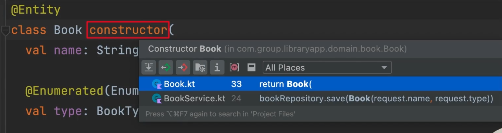

# kotlin 에서 JPA 를 사용할 때의 3가지 이슈들, 그리고 constructor


### 1\) setter 가 열려있다.

setter 가 public 열려있기 때문에 불편할 수 있다.

코드상 setter 를 사용하게 될 수 도 있다는 점은 단점

이 경우 아래와 같이 코드를 변경해줄 수 있다.

<br>


#### 방법 1) backing property 사용하기

```kotlin
class User(
    private var _name: String
){
    val name: String
    	get() = this._name
}
```

<br>


`_name` 처럼 앞에 `_` 가 붙은 필드를 추가해주고 이것에 대해 외부에는 커스텀 객체를 사용한 `name` 을 열어준다.

(계산기에서 이야기했던 내용)

이렇게 하면

- 내부에서는 `_name` 으로 접근해서 이름을 바꿔줄 수 있고
- 외부에서는 불변인 `name` 에 접근해서 단순히 값을 가져가기만 하면 된다.

<br>


#### 방법 2) custom setter

생성자에서는 `name` 이라는 파라미터를 받게끔 해주고

그리고 이것을 클래스 바디의 `name` 프로퍼티에 연결시켜주고 이 때 `name` 프로퍼티에 대한 setter 를 private 하게 연결시켜준다.

<br>


방법 1), 방법 2) 모두 필드가 많아지면 관리가 힘들어진다.

<br>


그래서 setter를 열어는 두지만 사용하지 않는 방법을 선택하는 것도 나쁜 것은 아니다.

팀에서도 setter 를 사용하면 안된다는 것을 안다면, 코딩 컨벤션을 잘 맞춘다면, 

<br>


#### 방법 3) JPA 와 data class

JPA Entity 는 data class 를 사용하지 않는 것이 좋다.<br>

data class 는 equals, hashCode, toString 등의 함수를 자동으로 만들어준다. equals, hashCode, toString 함수는 JPA Entity와 함께 쓰기에는 부적합하다. 연관관계 상황에서 무한으로 equals를 호출하게될 수도 있고, toString 함수를 무한으로 호출하게 되는 경우도 생길수 있기 때문이다.<br>

**e.g. 1:N 연관관계**

1:N 연관관계를 맺고 있는 상황에서 User 쪽에 equals()가 호출되면, User는 자신과 연관관계를 맺고 있는 UserLoanHistory 의 equals() 를 호출하고, UserLoanHistory는 자기 자신과 연관관계를 맺고 있는 User의 equals() 를 호출하게 된다.<br>

이런 이유로 JPA Entity 는 data class 를 피하는 것이 좋다.<br>

<BR>



