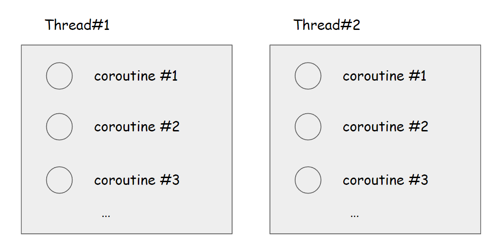

# Kotlin - Coroutine, ThreadPool, Dispatcher

시간날 때마다 계속 해서 정리한 내용을 추가 예정!!! 

<br>


### 참고자료

https://www.baeldung.com/java-completablefuture

https://jutole.tistory.com/8

https://d2fault.github.io/2021/02/21/20210221-coroutine-context-and-dispatchers/

https://velog.io/@haero_kim/Kotlin-Coroutine-Dispatchers-1%ED%8E%B8

<br>


### 코루틴 (Coroutine) vs 스레드 (Thread)

> [https://en.wikipedia.org/wiki/Coroutine](https://en.wikipedia.org/wiki/Coroutine)

코루틴은 코틀린에만 있는 개념이 아니다. go 언어에도 존재하고, python 에도 존재하고 ruby, c++ 에도 존재하는 개념이다. 코틀린에는 자바언어 기반으로 코틀린 내에 해당 기능이 제공된 것으로 보인다. <br>

코루틴은 쉽게 설명하면 아래와 같은 개념이다.



<br>

스레드 하나 안에서 돌아가는 서브 스레드(?) 같은 개념.<br>

서브스레드라는 용어는 없다. 스레드보다는 가볍다는 의미로 경량(lightweight) 스레드라고 이야기하는 편인 것 같다.<br>

보통은 어떤 언어에서든 스레드 하나를 생성하고 관리하는 데에 많은 비용이 소모된다고 한다. OS 또는 JVM의 스레드 스케쥴링 알고리즘에 대한 정책 때문에 소요되는 시간적 자원문제도 있고, 스레드 하나당 소모하는 메모리 비용도 한 몫 할 듯 하다. <br>

폭주하는 단건 메시징 트래픽의 경우를 예로 들어보자. 이 경우 스레드 풀 설정만으로 처리하려고 하면 초반에는 처리가 잘 되겠지만, 스레드를 계속 점유하면서 스레드 풀이 결국 부족한 사태에 이른다. <br>

스레드 풀이 꽉찰 경우 ExecutorService를 쓴다면 ThreadPoolExecutor 내부 작업 큐를 사용하는데, 이 작업큐도 결국은 모두 꽉 차면 Out Of Memory Error 를 내거나 또는 런타임에 에러 자체가 안잡힌다. (스레드의 경우 모니터링으로도 엉뚱한 위치를 추론하게 되거나, 에러로그도 잘 안잡힌다.)<br>

그런데 이렇게 한정적인 스레드를 스레드 하나 안에서 코루틴이라는 단위로 나눠서 처리한다면? 그나마 부하가 덜 가지 않을까 싶다. go 언어를 채택하는 서비스들이 늘어나는 추세도 어찌보면 코루틴을 지원하기 때문일지도 모른다는 생각을 해봤다.<br>

스레드는 무한으로 찍어낼 수 없다. 결국은 물리적으로 찍어낼 수 있는 스레드의 갯수는 한계가 있다. 코루틴은 이런 스레드 하나 또는 다수의 스레드 안에서 마치 코루틴 기반의 CompletableFuture를 사용하듯 스레드 하나 안에서 동시성 프로그래밍을 하는 것을 의미한다.<br>

요약하자면, 코루틴을 사용하면 스레드를 절약해서 사용할 수 있다!! 스레드 하나를 여러 흐름으로 나누어서 사용할 수 있다!! 이정도로 컨셉을 정리할 수 있을 것 같다.<br>

JVM 언어 중에서는 코틀린 이전에는 Scala, Groovy (참고 : [Closures and Coroutines](https://medium.com/pragmatic-programmers/4-6-closures-and-coroutines-c660debc1cc1)) 에서 이미 코루틴을 지원하고 있던 것으로 보인다.

- 넷플릭스와 같은 기업에서는 함수형 프로그래밍이 지원이 안되던 시절부터 함수형 프로그래밍 방식을 채택해야 하는 부분들에 대해 일찍부터 groovy 를 사용했다고 한다. groovy 에서는 Closure, Coroutine 등이 지원된다. 빌드 속도가 느리지만, 이런 점을 포기하고서라도 함수형 프로그래밍의 장점을 포기할 수 없었다고 한다.
- 1달 전 쯤 읽었던  [실전! 스프링5를 활용한 리액티브 프로그래밍](http://www.yes24.com/Product/Goods/74394497) 에서 이런 내용들을 읽었던 것으로 기억..

<br>


### Dispatcher

jetbrains 에서 제공하는 Dispatcher 는 Dispatchers.Default, Dispatchers.Main, Dispatchers.IO, Dispatchers.Unconfined 등의 Dispatcher들이 있다.<br>

Dispatcher는 내부적으로 스레드 풀을 만들어둔 상태에서, 코루틴을 어떤 스레드에서 실앻할지, 스레드의 부하에 따라서 코루틴을 스레드에 적절하게 분배해준다.<br>

만약 Dispatcher 를 커스텀으로 생성하지 않아도 위의 4 종류의 Dispatcher 들 중 하나를 선택해 사용하더라도 트래픽 처리가 안정적이라면 jetbrains에서 기본으로 제공해주는 Dispatcher 기능이 안정적이라는 의미다.<br>

<br>

#### Dispatcher 의 종류

https://jutole.tistory.com/8


Dispatcher 들은 아래와 같다.

- Dispatchers.Default
  - CPU 를 많이 사용하는 작업을 Main Thread 가 아닌 다른 Thread에서 수행하도록 하기위해 사용하는 스레드
  - CPU 코어 갯수만큼 동시에 돌릴 수 이다. 최소 2개로 돌린다.
  - List 정렬, JSON Parsing 에 최적화되어있다.
- Dispatchers.Main
  - UI 관련 잡업에 관련된 스레드를 분배해주기 위한 디스패처 (안드로이드)
  - UI 에 관련된 작업에만 사용해야 한다.
- Dispatchers.IO
  - 디스크 작업, 네트워크 작업, 이미지 다운로드, 네트워킹, DB 작업 등 Thread 를 오랫동안 블로킹하는 작업을 스레드 풀에 분배하기 위한 디스패처
  - Dispatchers.Default 와 스레드를 공유하고 있다고 한다.
- Dispatchers.Unconfined
  - 코루틴이 호출된 스레드에서 코루틴을 시작하지만, 어떤 스레드에서도 코루틴이 다시 재개될 수 있도록 스레드를 분배하는 Dispatcher
  - 기본은 호출한 Context 에서 코루틴이 실행되지만, 다시 재개될 때 다른 Context(스레드)에서 실행될 수도 있는 Dispatcher

<br>


#### 커스텀 Dispatcher, Thread - Thread Context 함수

대표적으로 newFixedThreadPoolContext(name: String), newSingleThreadContext(name: String) 가 있다. 

위의 두 메서드는 ExecutorCoroutineDispatcher 객체를 생성하는 역할을 한다.

스레드를 직접 생성해서 Dispatcher 에 담아서 사용자가 정의하는 **커스텀 Dispatcher** 를 생성할 때 사용한다.

이렇게 해서 생성한 스레드는 **엄청난 고비용**이다. 

코틀린에서 제공하는 기본 디스패처를 사용한다면 스레드 안에 들어갈 수 있는 코루틴이 많을텐데, 위와 같이 특정 코루틴들을 실행하기 위한 스레드 하나를 생성한다는 것은 꽤 자원 낭비를 하는 셈이다. (**새차원님 강의 참고**)

만약 이렇게 커스텀 디스패처를 만들었다면, @Bean 으로 선언해서 다른 곳에서도 사용할 수 있도록 하거나 더 이상 사용하지 않을 때에 꼭 close() 함수를 사용해 메모리에서 해제해야 한다.

<br>

사용은 아래와 같이 한다.

```kotlin
val dispatcher = newFixedThreadPoolContext(1, "printHelloThreadPool")

CoroutineScope(dispatcher).launch{
    println("안녕하세요")
}

dispatcher.close()
```

<br>


### 코루틴 빌더

##### async() 

결과가 예상되는 코루틴을 시작하는 데에 사용된다.

async() 는 코루틴 내부에서 일어나는 모든 예외를 캡처해서 결과에 넣기 때문에 조심해서 사용해야 한다.

결과 or 예외를 포함하는 `Deferred<T>` 를 반환한다.

e.g.

```kotlin
val jobA = CoroutineScope(Dispatchers.IO).async{ 
    println("jobA") 
    delay(1000)
    return 10
}

val jobB = CoroutineScope(Dispatchers.IO).async{
    println("jobB")
    delay(1000)
    return 10
}

println(" a x b = ${jobA.await() * jobB.await()}")
```


CoroutineScope 를 쓰다보니 GlobalScope가 떠올라서 어쩔수 없이 코루틴 빌더도 정리해야 하게 되었다. 다만 이 문서의 어느 부분에 써야 할지 아직은 결정하지 못했다.


### 예제 준비...

처음에는 사이드 프로젝트로 예제를 만들어보려고 했는데, 생각해보니 그럴 필요가 없다는 생각이 들었다. 따로 프로젝트를 열어서 여러가지 연습코드를 작성해보려 한다. 예를 들면 10만 건 정도의 데이터에 대한 덤프 파일을 만드는 테스트 코드를 만들고 만든 데이터를 REDIS 에 넣어둔 후, delay 함수를 통해 여러가지 IO 연산들(DB, 캐시접근, 소켓 푸시 등)을 가정하는 여러가지 시나리오의 테스트들을 작성해봐야겠다 싶었다.<BR>

잠깐 개인적인 사정이 생겨서... 금요일 이후부터 다시 시작 가능할 듯!!<BR>

<BR>

