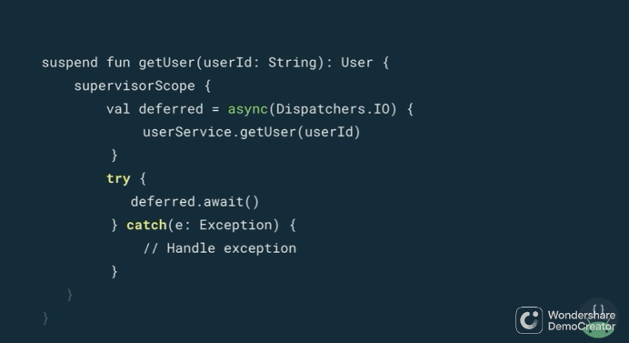

#  Kotlin Coroutines 101 - Android Conference Talks

주말동안 코루틴 관련해서 한국 개발자분이 유튜브에서 강의한 내용도 봤었고 안드로이드 개발자 유튜브도 봤다. 오늘은 그 중 안드로이드 개발자 유튜브에서 본 내용을 정리하기로 했다. 강의 내용을 정리하는 게 꽤 빡셨다. 인프런에서 10분에서 20분 컷 사이로 짧게 끊어서 강의 잘하는 분들이 새삼 대단하다는 생각이 들었었다. 그만큼 요약을 잘하시는 분들이 아닐까 하고 생각했었다.

<br>

강의 들으면서 영어 내용 앞으로 뒤로 5초 왔다 갔다하며 발음 확인하면서 필기하면서 3시간, 요약하면서 주관적으로 정리하는 데에 2시간... 어휴... 힘들었다.

<br>

직관적으로 들으면 그냥 이해가 잘되고 make sense 해보이지만, 하나씩 필기해보면서 듣다보니 새로운 내용을 이해하게 되고 그래서 나쁘진 않았다고 생각한다.

<br>


### 강의 링크

[Kotlin Coroutines 101 - Android Conference Talks](https://www.youtube.com/watch?v=ZTDXo0-SKuU)

<br>


### 추후 정리할 부분

강의 도입 부이고 왜 코루틴을 쓰면 편한지, 스테이트 머신은 어떤 식인지 등에 대해 설명하는 부분인데, 이 부분에 대해 캡쳐는 했으나, 시간이 조금 부족해서 정리를 못했다.<br>

<Br>

강의 내용을 필기하는 것도 꽤 힘들었지만, 이걸 요약하는 일도 꽤 시간이 걸려서 몇 주에 걸쳐서 깔끔하게 정리해나가야 겠다는 생각이 들었다. 이 외의 시간에는 지금까지 배운 코루틴관련 지식을 토대로 개인적으로 실험을 해보거나 사이드프로젝트에 적용을 해보는 작업들을 해볼것 같다.

<br>


### Callback, Continuation

코틀린 컴파일라는 suspend 가 가능한 computation 일 경우 코루틴이라는 지붕(후드) 아래에 Callback 에 정의해둔 computation 들을 정의한다.


### Continuation


만약 아래와 같은 코드가 있다고 해보자.

```kotlin
suspend fun loadData(){
    val data = networkRequest()
    show(data)
}
```


위의 코드 처럼 `suspend` 키워드가 붙은 `loadData()` 함수를 일반 함수로 치환해보면 아래와 같이 continuation 을 받는 함수로 대체된다.

```kotlin
fun loadData (continuation: Continuation){
    val data = networkRequest(continuation)
    show(data)
}
```


### State machine

callback 처럼 전달된 코드 블록은 코루틴 내부에서 Continuation 으로 치환되고 이 부분은 스테이트 머신을 통해 처리되는데, 그 과정을 그림으로 표현하면 아래와 같다.


<br>


<br>


<br>


<br>


### With Corutines ... (코루틴을 사용하면 수행되는 동작)


코루틴을 사용하면 Computation 이 스레드를 블로킹하지 않으면서 suspend 된다.

<br>


```kotlin
withContext(Dispatchers.IO){
    // ... computation code
}
```

이 코드 처럼 `Dispatchers.IO` 에 기반한 코루틴 컨텍스트에서 실행된다는 것은 이런 의미다.

- Hey, I want to run this computation in this particular thread

<br>


### Main Safe


withContext 에서 블로킹 구문을 실행하는 것은 다른 스레드에서 실행하는 것을 의미하기에 Main 스레드를 블로킹하지 않는다.

강의에서는 이것을 Main Thread 를 블로킹하지 않기에 Main Thread에 대해 Safe 하다 라고 설명한다.

안드로이드에서는 메인 스레드가 블로킹되면 다른 UI동작도 멈추기에 치명적이다. 그래서 메인스레드를 블로킹하지 않는 것이 중요한 듯 해보인다. (안드로이드 모름..;;)

<br>


### Dispatchers 내의 IO, Main, Default 각각의 의미


Dispatchers.Main

- UI/Non-blocking 코드를 실행하는 데에 최적화된 디스패처를 의미한다.

Dispatchers.IO

- 네트워크, 디스크 IO 를 실행하는 데에 최적화된 디스패처를 의미한다.

Dispatchers.CPU

- 계산작업 (CPU 작업)을 실행하는 데에 최적화된 디스패처를 의미한다.

<br>


### 코루틴이란?


코루틴은 어떠한 코드 블록을 어떤 스레드 안에서 실행하는 것을 의미한다. 코루틴은 강력하다!!

<br>


### suspend 함수를 다른 함수에서 호출할때


suspend 함수로 선언된 loadData() 를 일반 함수에서 호출하면 컴파일 에러가 난다. 그렇다면 어떻게 해야 할까?


이럴 때는 일반 함수에서 launch{...} 를 이용하면 코루틴 함수를 실행할 수 있게 된다. launch{ ... } 를 사용하면 코루틴을 유발(Trigger)할 수 있다.

> In this case, We can use launch to trigger to coroutine.

물론, 위의 코드는 아직까지는 컴파일 에러를 낸다. 코루틴 스코프 위에서 실행하지 않았기 때문이다. 코루틴 스코프에 대해서는 Structured Concurrency 를 다룬 후 잠시 뒤에 다루게 된다.

<br>


 여기서 몇 가지 문제점을 떠올릴 수 있다.

- 현재 코루틴의 실행을 누가 Cancel 할 수 있을까?
- 라이프 사이클이 따로 있는가?
- 코루틴이 실패하면 익셉션은 누가 받을까?

<br>

Structured Concurrency 는 코루틴을 이용해 작업할 때 위의 질문들에 대해 생각할 수 있게 해준다.

Structured Concurrency 는 코루틴 스코프라는 개념과 함께 위의 세 질문들을 해결할 수 있게 해준다.

<br>


### Structured Concurrency


<br>


- 현재 코루틴의 실행을 누가 Cancel 할 수 있을까?
- 라이프 사이클이 따로 있는가?
- 코루틴이 실패하면 익셉션은 누가 받을까?


코루틴 스코프는 위에서 살펴봤던 질문들인 아래의 질문 3개에 대해 아래의 기능들을 제공한다.

- 코루틴 스코프는 코루틴들을 추적 가능하다
- 코루틴 스코프는 코루틴을 취소할 수 있다
- 코루틴 스코프는 코루틴의 실패를 notify 받을 수 있다.


### Coroutine Scope


위에서 살펴봤었던 위의 코드는 컴파일 에러를 낸다. launch 는 반드시 코루틴 스코프에서 실행되어야 하기 때문이다.

<br>


**launch 는 반드시 코루틴 스코프 위에서 실행되어야 한다.**

launch 라는 코루틴 빌더는 코루틴 스코프에서 생성해야 하는데, 위의 코드에서는 CoroutinScope 생성자와 Dispatchers.Main 을 통해 코루틴이 실행될 스레드를 지정해서 CoroutineScope 객체를 생성했다. 


만약, 코루틴의 라이프 사이클을 컨트롤하기 원한다면, 코루틴 스코프를 생성해서 이 스코프에서 launch 를 실행시키면 된다.

> So, whenever you want to control the lifecycle of coroutine, you can create a coroutine scope.
>
> So, In this case, we can use this scope to trigger the computation and that the computation will follow the lifecycle of that particular scope

<br>


그리고 위의 코드에서는 loadData() 라는 suspend 함수를 호출하고 있는데, suspend 함수를 일반 함수인 onButtonClicked() 에서 호출하려면 해당 일반 함수 역시 suspend 함수이거나, 일반함수가 CoroutineScope 위에서 실행되어야 한다. 이 둘 중 하나의 조건을 만족해야 한다.


위와 같이 loadData() 는 suspend함수인데, suspend 로 정의한 함수를 호출하는 caller 함수는 반드시 suspend 함수여야 한다. 만약 caller 함수를 suspend 함수로 정의하지 않을 것이라면 loadData() 함수를 CoroutineScope 객체 위에서 실행시키면 된다.


이렇게 해서 생성된 코루틴 스코프는 계층구조를 갖게 된다. 

이렇게 Parent, Child 처럼 부모, 자식 관계를 갖는 것을 "Structured Concurrency" 라고 부른다.


### Cancelling a Scope


예를 들면 안드로이드 Activity 안에서 onCleared() 라는 이벤트 핸들러 내에서 scope.cancel() 함수를 호출하는 경우를 보자.

<br>


scope 를 cancel 한다는 것은 이런 의미를 갖는다.

- 모든 자식 코루틴들을 취소한다.
- 스코프를 더 이상 사용할 수 없다면, 다른 코루틴들을 시작할 수 없게 된다.

<br>


위에서 살펴봤듯 suspend 함수는 Coroutine Scope 위에서 실행되어야 하거나, 스코프위에서 실행하는 것이 아니라면 또 다른 suspend 함수에서 호출되게끔 하면 된다.


일반적으로 함수가 리턴을 하면 모든 작업을 마쳤다는 의미를 갖는다. suspend 함수 역시 비슷하게 같은 의미를 갖는다.


어떤 suspend 함수가 어떤 값을 리턴을 한다면 이것은 suspend 함수가 모든 작업을 마쳤다는 의미가 된다.

<br>


### Scope Exception Handling


<br>


Scope 는 Job 역시도 인자로 받을 수 있다.

Job 은 Life Cycle 을 정의한다.

Job 객체를 Scope 의 파라미터에 두면 Exception Handling 을 특정 방식(particular way)으로 처리할 수 있게 된다.


### Scope with a Job


만약 자식 코루틴이 오류가 나서 실패(fails)하면 **Job이 결합되어있는 스코프**는 작업의 취소를 다른 자식 코루틴들에게 전파한다.

실패(failure)가 전파되면, 스코프는 Exception 을 상위 스코프로 전파한다.

<br>


loadData 가 실패하면 실패한 스코프로 notify를 하게 된다.

그러면 스코프는 이전에 만들어진 자신이 가지고 있는 다른 자식들을 cancel 한다.

<br>


### Scope with a SupervisorJob


그런데 단순 Job() 을 이용한 방식을 사용할 경우 Application Crash 를 낼 수도 있다. UI에 관련된 스코프도 함께 종료될 수 있기 때문이다.

자식 코루틴이 throws 를 해서 종료를 시켜야 하더라도 부모 코루틴은 그대로 실행되야 할 경우가 있다. 예를 들면 UI 에 관련된 스코프다. 

이때 우리는 Job() 을 사용하는 대신 SupervisorJob() 을 사용할 수 있다.

<br>


SupervisorJob 을 사용하면 다른 자식 코루틴에게 영향을 주지 않는다.

failure 가 위로 전파되더라도 부모스코프는 아무것도 하지 않는다. (자식으로부터 예외가 전파되어도 부모스코프가 종료되거나 등의 작업이 발생하지 않는다.)

<br>


즉 위의 코드는 이런 의미를 갖는다..

스코프 scope 는 loadData() 중에 예외가 발생해서 예외를 전달 받더라도 scope 에 붙어있는 다른 스코프에게 까지 이 예외를 전파하지 않는다.

scope 는 만약 loadData 에서 예외를 전달 받더라도 "Okay, I have this exception, but I'm not going to cancel other children."

따라서 SupervisorJob을 사용하면 예외가 발생한 것에 대해 따로 try \~ catch 구문을 작성해야 한다.


요약해보면 이렇다.

- suspend 함수가 return 을 한다는 것은 작업이 완료되었음을 의미한다.
- scope가 cancel 하면 자식들도 cancel 된다.
- coroutine 이 에러를 내면 스코프는 이것을 통지(notify) 받는다.

<br>


### Create Coroutines


Launch 와 Async 사이에 다른 점은 두가지다

- Launch 는 Fire and Forget 이지만, Async 는 Returns a value 다.
- Launch 는 Re-throws exceptions 이지만 Async 는 Holds on exceptions until await is called 이다.

Launch 와 Async 모두 suspend function 이 아니다. (Not a suspend function)

Launch 와 Async 내에서 suspend function 을 호출할 수 있지만, Launch 와 Async 는 suspend function 이 아니다.

(suspend function 은 suspend function 에서만 호출할 수 있다.)

단, suspend function 은 코루틴 스코프에서 호출하는 것 역시 가능하다.

<br>


Launch

computation 을 trigger 하기 위해 CoroutineScope 인 scope로 launch 할수 있는데, 그걸로 끝이다.

그 이후는 고민하지 않아도 된다.

<br>


Async

Async 를 사용하면 새로운 코루틴을 생성한다.

그리고 값을 리턴한다.

CoroutineScope 를 생성자인 CoroutineScope()를 이용해서 직접 생성할 수도 있지만, coroutineScope 를 통해 생성할 수도 있다. 이번 예제에서는 coroutineScope { ... } 라는 코루틴 빌더를 사용했다. 

아래 코드에서 async 가 deferred 를 리턴했다. deffered 객체는 Java 의 promise, future 와 같은 개념이다.

await() 은 async 에서 특정 동작을 수행한 후 리턴하는 값을 그대로 리턴해준다.

<br>


### Exception Handling


<br>


launch 에서 try/catch 를 이용한 Exception Handling은 위의 코드와 같다.

loginService 의 upload()함수가 exception 을 유발가능한 함수라고 할 때 

launch 에서 Exception 을 처리할 때는 try ~ catch 구문으로 loginService의 upload() 함수를 감싸주어 처리하면 된다. 이렇게 하면 loginServie 로부터 발생하는 Exception 을 핸들링 할 수 있게 된다.

<br>




async 에서 try/catch 를 이용한 Exception Handling은 위의 코드처럼 이뤄진다.

async 는 Exception 을 throw 하지 않는다. 따라서 try/catch 로 async 블록을 감쌀 필요가 없다.

만약 try/catch 로 감싸야 한다면 await() 에 try/catch 로 감싸주면 된다.

<br>


### Cancellation requires co-operation


Cancellation 은 co-operation 을 필요로 한다. isActive 와 같은 조건변수에 접근해야 코루틴이 취소되었는지 안닌지를 확인할 수 있는데 이것을 yield() 라는 함수를 사용함으로써 확인가능하게 된다.

<br>


이렇게 비싼 비용이 필요한 작업들을 할 때 (e.g. 파일을 읽는 작업 등)

이런 작업을 Cancellable 하게끔 만들어야 한다.

코루틴 또는 스레드에게 있어서 파일을 읽는 작업은 busy 상태로 만든다. 그리고 이런 작업은 작업의 취소를 listen 하고 있지 않게 된다. 

예를 들어 아래와 같은 코드가 있다고 해보자.

files 라는 파일이름의 배열을 순서대로 순회하면서 파일을 읽는 IO 작업을 코루틴 스코프에서 실행하고 있다.

<br>


이런 경우 coroutine 이 isActive 상태인지 체크하는 것이 필요하다. 이런 경우 isActive 라는 스코프 변수를 사용하거나 또는 ensureActive() 함수 또는 yield() 함수를 사용한다.

코루틴이 취소될 때 마다 (whenever coroutine is cancelled)

ensureActive(), yield() 같은 함수가 호출된다.

ensureActive(), yield() 같은 함수가 호출되면 코루틴의 실행(Execution)을 중단시킬수 있다.

무거운 작업(heavy computation)을 수행하면, cancellation 을 수행하는지를 체크하면 된다.

<br>


### When to mark a function as suspend


그렇다면 언제 함수를 suspend 로 표시해야 할까?

<br>


다른 suspend 함수를 호출할 때 그 함수를 suspend 로 표시하면 된다.

networkRequest() 함수는 suspend 키워드와 함께 선언된 함수인데 내부적으로는 withContext {...} 라는 빌더와 함께 사용된다.

<br>


### Tip

suspend 를 꼭 써야만 하는 상황이 아니라면 함수에 suspend로 표시하지 않는 것이 좋다.

(참고 : be forced to 의 뜻... : https://redkiwiapp.com/ko/questions/YbS1hjSD9Y2rhYfMIyKF )

Testing asynchronous code is quite difficult

you want that test behave allways in the same way.

we'll gonna see different use cases for the different ways you have to do that


### Unit testing coroutines


#### Use Case 1 ) 테스트가 새로운 코루틴을 트리거하지 않는 경우


<br>


loadData() 는 async{}, launch{} 를 호출하지 않는다.

loadData() 함수는 suspend 함수이지만, 새로운 coroutine 을 트리거링하지는 않는다.

물론 networkRequest() 함수에서 withContext{} 를 통해 다른 스레드로 이동하지만,

loadData() 자체는 새로운 coroutine 을 트리거링하지는 않는다.

이런 경우는 이대로 괜찮다. 이것이 첫번째 Use Case 다.

<br>


You can test this use runBlocking

runBlocking 은 코루틴 라이브러리의 한 메서드다.

runBlocking 을 통해 호출되면, 블로킹 상황에서 코루틴을 시작하게 된다.

즉, runBlocking 내에 정의된 코드 블록이 모두 끝날 때까지 스레드가 블로킹된다.

위의 runBlocking{...} 내에서 viewModel.loadData() 는 synchronously 하게 동작한다.

따라서 viewModel.loadData() 다음의 라인에서는 viewModel.loadData() 의 동작이 모두 끝나 있음을 보장가능하다.

따라서 Assert 구문을 아무 문제 없이 수행 가능하다.

참고) loadData() 는 아래와 같았었다.

```kotlin
suspend fun loadData(){
    val data = networkRequest()
    show(data)
}
```


#### Use Case 2 ) 테스트가 새로운 코루틴을 트리거하는 경우


<br>


MyViewModel.kt 내의 onButtonClicked 는 아래와 같이 정의되어 있다.

```kotlin
// MyViewModel.kt

val scope = CoroutineScope(
    Dispatchers.Main + SupervisorJob()
)

fun onButtonClicked(){
    scope.launch {
        loadData()
    }
}
```


그리고 이 onButtonClicked를 호출하는 부분을 테스트할 때 아래와 같이 하는 것은 좋지 않다.

onButtonClicked() 함수는 새로운 코루틴에서 실행된다. onButtonClicked() 함수 내에서는 launch{...} 를 통해서 다른 스레드에서 비동기적으로 loadData() 를 호출하고 있기 때문에 테스트하기에 쉽지 않다..

만약 Assert 를 한다면, assert 를 하는 시점에 다른 코루틴에서 돌아가고 있는 중이기에 테스트가 reliable 하지 않게 된다.

<br>


테스트를 CountDownLatch, LiveDataTestUtil, Mockito await 등을 사용해서 어떤 동작을 기다리는 등의 동작을 할수도 팄겠다. 하지만 코드스멜이 심해지게 된다. 역시 좋은 관례는 아니다.

<br>


하지만 기본적으로 위와 같이한다면 가능하다.

코루틴을 특정 디스패처에서 실행되게끔 하고, 그 디스패처를 생성자를 통해 주입하면 가능하다.

그리고 onButtonClicked() 내에서 사용하는 launch 는 외부에서 주입받은 디스패처를 사용하도록 하면 테스트 시에 특정 동작을 제어할 수 있게 된다.

<br>


그리고 테스트 코드에서 실행되게끔 할 때는 testDispatcher.runBlockingTest { ... } 내에서 실행되게 해줬다. 이렇게 runBlockingTest{ ... } 에서 실행되도록 해주었는데, 이렇게 하는 것으로 인해  MyViewModel 에 전달하는 testDispatcher 는 동기적으로 동작하는 것임을 보장할 수 있게 되었다.

이렇게해서 viewModel 의 onButtonClicked 에서 실행되는 코루틴 역시 synchronously(동기적으로)하게 실행되는 것을 보장하게 되었다.

이것의 의미는 onButtonClicked() 가 끝나면 코루틴 역시 끝난 것임을 보장한다는 의미가 된다.

<br>


하지만, 위의 코드에서 주석친 부분에 코드 블록이 있을 경우 이 곳에서 실행될 부분의 코드를 테스트하려면 어떻게 할지는 아직 자세히 모른다.

주석으로 표시한 부분 처럼 다른 코루틴으로 이동(scope.launch) 하기 전에 수행하는 동작은 어떻게 테스트할까?

<br>


<br>

이 경우는 위의 코드처럼 해주면 된다. TestCoroutineDispatcher() 에는 pauseDispatcher() 라는 기능이 있다. 새로운 코루틴으로 비동기적으로 흘려보내지기 전에 디스패처를 잠시 멈춘다. 이렇게 하면 버튼 클릭 후 scope.launc{...} 하기 전의 동작을 테스트 할 수 있게 된다.

<br>


그리고 새로운 코루틴으로 실행한 구문을 테스트 하는 것은 위의 코드처럼 testDispatcher.resumeDispatcher() 를 통해 디스패처를 재개하는 것으로 가능하게 된다.

<br>

정리해보자.


1\) 새로운 코루틴을 생성하는 경우가 아니라면 runBlocking 을 사용하자.


<br>


2\) 좋은 습관으로써 Dispatcher 를 주입받아서 사용하라. 그리고 테스트에서는 TestCoroutineDispatcer 를 사용하라.


<br>


### What we covered & Next steps


<br>


<br>


