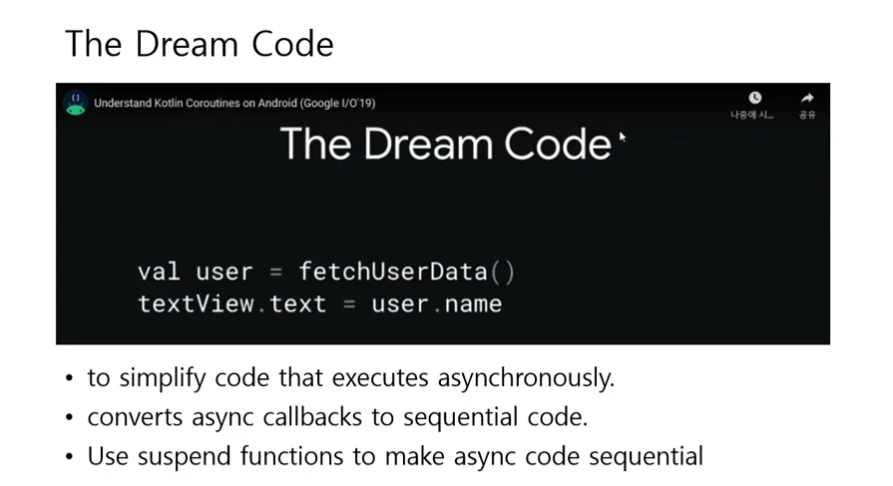
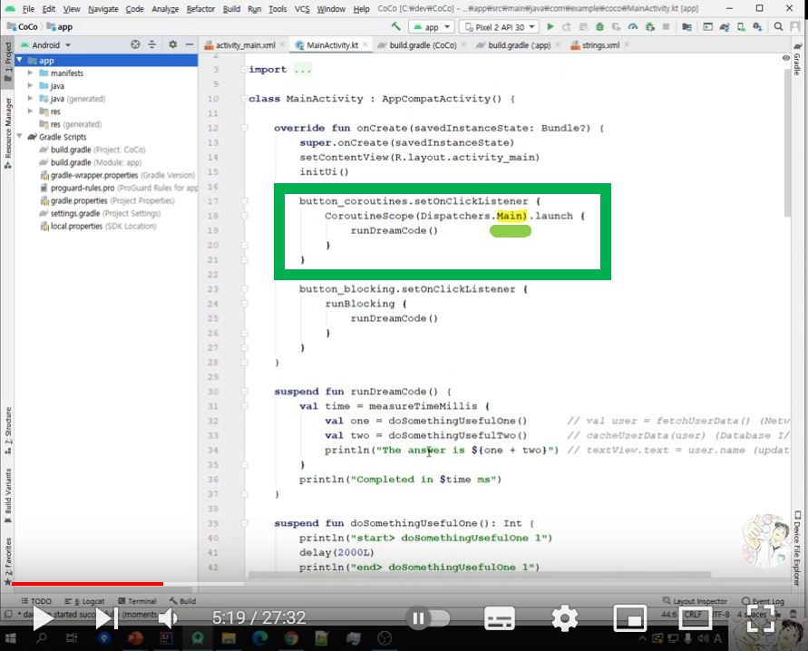
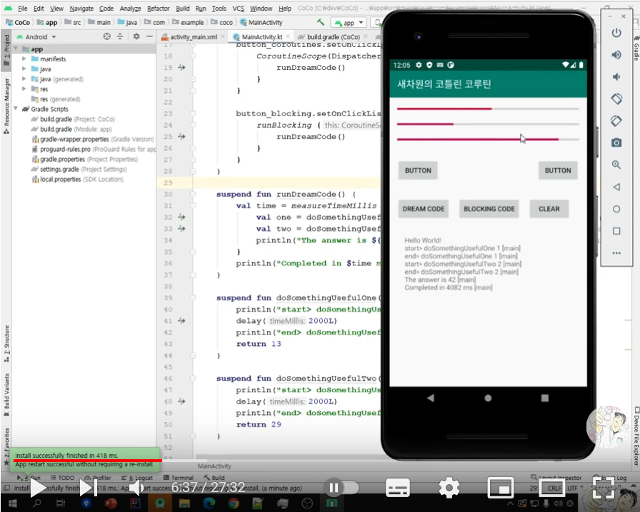
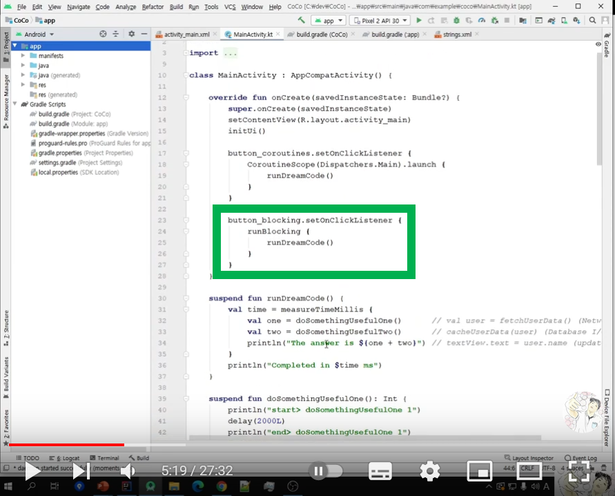
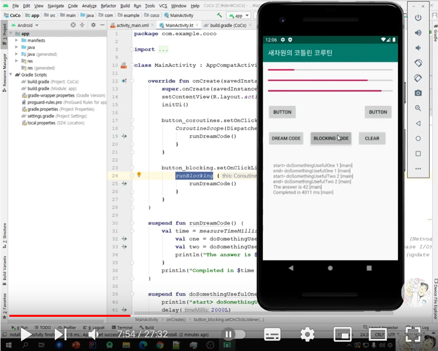
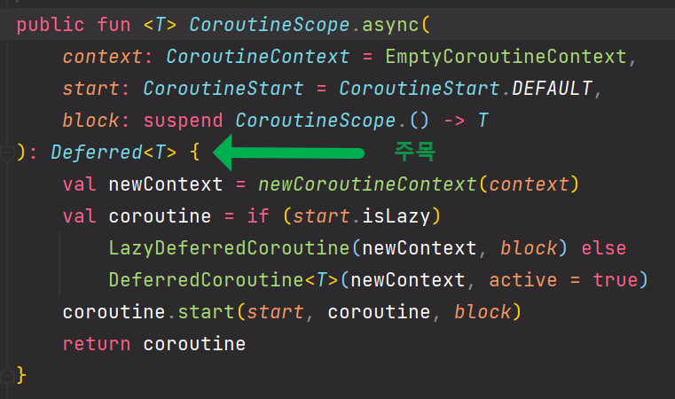
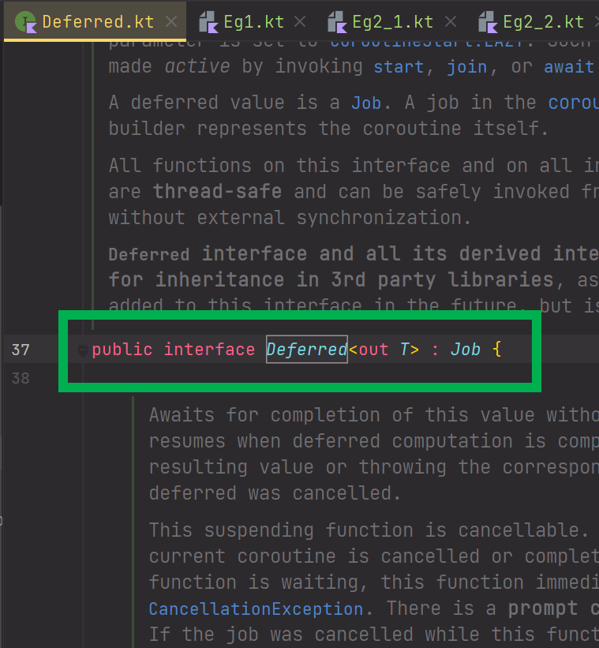
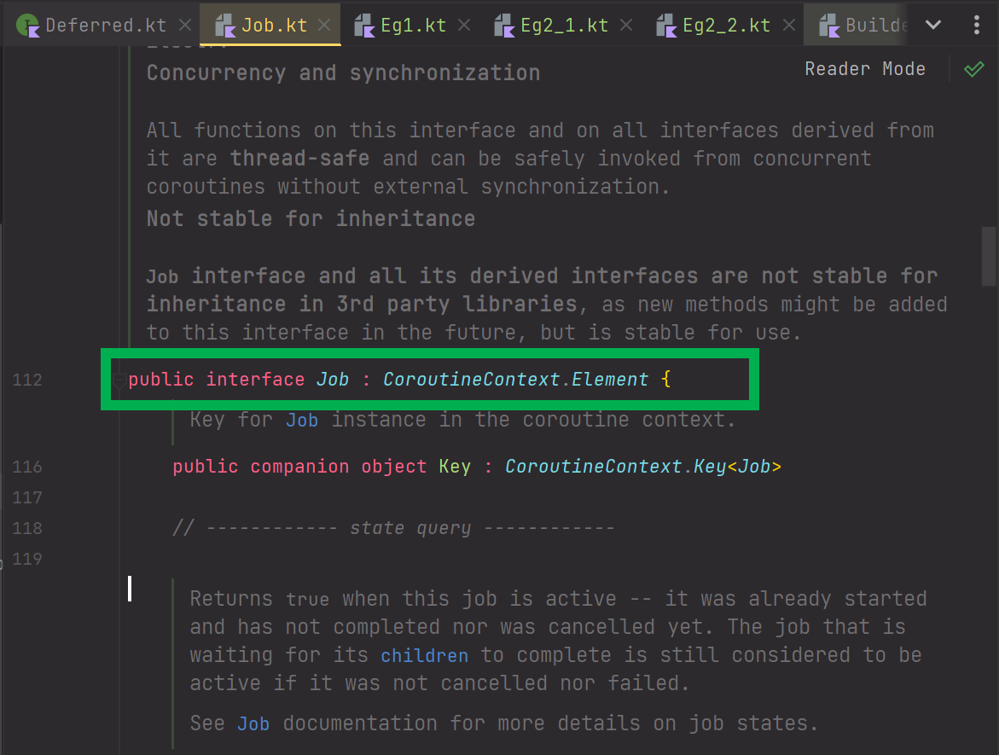
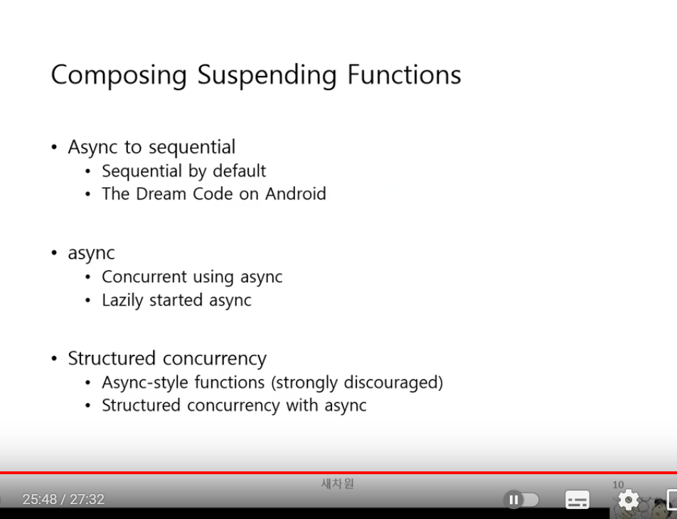

# 새차원-강의요약 Composing Suspending Functions



<br>

- 비동기 실행을 단순하게 만들어준다.
- 비동기 실행을 순차적인 코드로 변환해준다.
- 비동기 코드를 순차적으로 만들기 위해 suspend 함수를 사용한다.

<br>


### 참고자료

- [새차원의 코틀린 코루틴(Coroutines) 강좌](https://www.youtube.com/playlist?list=PLbJr8hAHHCP5N6Lsot8SAnC28SoxwAU5A)

<br>


### 소스코드

- [study-kopring/kotlin-coroutines/examples/kotlin-coroutine](https://github.com/gosgjung/study-kopring/tree/main/kotlin-coroutines/examples/kotlin-coroutine)

<br>


### 용어정리

#### Dispatcher

스레드를 배분해주는 역할을 수행한다.

예를 들면 아래와 같은 코드를 예로 들 수 있다.




Dispatcher 는 lauch, runBlocking 등 코루틴 빌더로 만들어낸 Job을 어떤 방식으로 스레드 내에서 실행할지 정의 되어 있는 객체다.

Dispatcher 의 종류는 여러 종류가 존재한다.


#### 코루틴빌더

비동기 구문을 순서대로 수행되는 것을 보장할 경우 수십 줄의 비동기 스레드 구문을 join() 을 이용해 작업의 순서를 결정하도록 구현하느라 코드가 복잡해지거나, 코드의 순서를 일일이 기억해야 하는 단점이 있고, 또는 callback 기반으로 구현할 경우 callback 을 사용하느라 callback 지옥에 빠지거나, webflux 의 flatMap 처럼 flatMap 지옥에 빠지게 된다.<br>

예를 들면 Database 에서 사용자 id를 기반으로 사용자 정보를 조회한 후에 최근 구매한 도서 목록을 불러와야 할 경우 Database 접근로직이 2개인데, 이 두 코드를 모두 비동기적으로 수행할 경우 비동기 코드의 순차적인 실행을 보장해야 할 수 있다.<br>

이렇게 비동기 구문을 순서를 지어서 실행시키려 할 때 코루틴을 사용하면 순서대로 실행됨을 보장할 수 있다. 코루틴 스코프를 선택하고, Dispatcher의 종류를 선택해서 lauch, runBlocking등과 같은 코루틴 빌더를 통해 Job 단위의 코루틴을 실행하면, `Dream Code` 처럼 마치 순차적으로 실행 되는 비동기 로직을 수행할 수 있게 된다. 블로킹 기반으로 비동기 로직들을 모아서 실행할 수도 있게 된다.<br>

내부적으로 Job을 운영하는 스레드가 잘 돌아가도록 조율해주는 역할은 Dispatcher가 수행한다.<br>

<br>


### Sequential by default

> coroutine, just like in the regular code, is sequential by default.
>
> - 코루틴은 마치 일반적인 코드처럼 기본적으로 순서대로 실행됩니다.


두개 이상의 코루틴 코드를 같은 스코프 내에서 순차적으로 실행할 때, 코루틴 코드는 기본적으로는 순서대로 동작함을 보장한다.

마치 javascript 의 callback 을 실행하듯 순서를 지켜서 실행된다.

CompletableFuture 로 비유를 해보면, 마치 CompletableFuture를 순서대로 join 해둔 것처럼 순서를 지켜서 실행된다.


비동기 코드이기에 비동기 코드 끼리는 스레드 알고리즘에 따라서 순서가 섞여서 실행되거나 다른 스레드가 더 빨리 끝나는 등의 동작을 할것 같지만 그렇지 않다. 여러 개의 코루틴 코드를 실행할 때, 코루틴 코드 각각은 순차적으로 실행된다.

아래의 코드를 보자.

```kotlin
package io.gosgjung.study.kotlincoroutine.sachawon.ch04

import kotlinx.coroutines.delay
import kotlinx.coroutines.runBlocking
import kotlin.system.measureTimeMillis


fun main() = runBlocking {
    val time = measureTimeMillis {
        val one = doSomethingUsefulOne()
        val two = doSomethingUsefulTwo()
        println("The answer is ${one + two}")
    }
    println("Completed in $time ms")
}

suspend fun doSomethingUsefulOne(): Int{
    println(">>> doSomethingUsefulOne")
    delay(1000L)
    return 13
}

suspend fun doSomethingUsefulTwo(): Int{
    println("### doSomethingUsefulTwo")
    delay(1000L)
    return 29
}
```

<br>


출력결과

```plain
>>> doSomethingUsefulOne
### doSomethingUsefulTwo
The answer is 42
Completed in 2029 ms
```

<br>


1강에서 봤었던 프레젠테이션의 `The Dream Code` 와 같은 모습이다.


<br>


### 안드로이드의 Main 스레드에서 코루틴을 실행해도 Hang 이 안걸릴까? 

- launch : 안걸리고 정상적으로 수행한다.
- runBlocking : 중간에 중단된다.


#### launch

아래 코드를 보자.


runDreamCode() 를 Dispatchers.Main 에서 launch 하고 있다. Main 이라는 단어로 유추해볼때 메인스레드인 것 같은데, 여기서 함수 호출을 통해 delay 함수가 최종적으로 호출되고 있다.

delay() 함수는 블로킹 코드다. 그런데 버튼 클릭시 delay() 함수가 호출되었다. 정상적으로 수행될까? 하는 생각으로 실제로 안드로이드에서 실행하면 정상적으로 수행된다.<br>

위 코드가 정상적으로 수행되는 이유는 launch 라고 하는 코루틴 빌더에서 실행했기 때문이다. launch 는 코드를 비동기적으로 수행될 수 있도록 도와준다.<br>


<br>

**안드로이드에서 실행해보면**<br>

버튼을 클릭해도 어떠한 delay 현상 없이 잘 수행된다.



<br>


#### runBlocking

이번에는 아래 표시한 부분에 해당하는 버튼을 클릭해본다.




버튼을 클릭해보면, 아래 그림처럼 4초 동안의 pending 이 발생후 그 다음 UI 스레드 처리는 정상적으로 수행된다.

- 만약 이런 코드를 코루틴 없이 예전 방식으로 실행하면 다시 스레드를 돌리고 콜백을 받아야 하고 다시 업데이트 후에 runOnUIThread() 를 호출하는 등의 콜백 hell 이 발생한다.
- 반면 코루틴으로 실행하는 경우 단순하게 runBlocking 이라는 코루틴 빌더를 선택해서 실행했다.




### Concurrent Using Async

#### e.g. 1

```kotlin
package io.gosgjung.study.kotlincoroutine.sachawon.ch04

import kotlinx.coroutines.async
import kotlinx.coroutines.delay
import kotlinx.coroutines.runBlocking
import kotlin.system.measureTimeMillis

fun main() = runBlocking {
    val time = measureTimeMillis {
        val one = async { selectSomething1() } // 1)
        val two = async { selectSomething2() } // 2)
        println("The answer is ${one.await() + two.await()}")
    }
    println("Completed in $time ms")
}

suspend fun selectSomething1(): Int{
    println("select data (1)")
    delay(1000L)
    return 13
}

suspend fun selectSomething2(): Int{
    println("select data (2)")
    delay(1000L)
    return 29
}
```


1\) , 2\) 를 만약 동기적으로 실행한다면 1초 + 1초 = 2초 의 시간이 소요된다.<br>

하지만 위의 코드에서는 async 라는 코루틴빌더를 통해 실행하고 있고, <br>

1\), 2\) 가 모두 끝나길 기다리는 구문은 `println("The answer is ${one.await() + two.await()}")` 이다.<br>

결과적으로는 2초의 수행시간이 아닌 1초의 수행시간이 소요된다.<br>

<br>


출력결과

```plain
select data (1)
select data (2)
The answer is 42
Completed in 1032 ms

Process finished with exit code 0
```

<br>


#### e.g. 2

만약 아래와 같이 await() 하는 시점을 바꾼다면 어떻게 될까?

결과적으로는 2초가 걸리게 된다.

```kotlin
package io.gosgjung.study.kotlincoroutine.sachawon.ch04

import kotlinx.coroutines.async
import kotlinx.coroutines.delay
import kotlinx.coroutines.runBlocking
import kotlin.system.measureTimeMillis


fun main() = runBlocking {
    val time = measureTimeMillis {
        val one = async { selectSomething1_2() } // 1)
        val one_result = one.await() // 1.1)
        val two = async { selectSomething2_2() } // 2)
        println("The answer is ${one_result + two.await()}")
    }
    println("Completed in $time ms")
}

suspend fun selectSomething1_2(): Int{
    println("select data (1)")
    delay(1000L)
    return 13
}

suspend fun selectSomething2_2(): Int{
    println("select data (2)")
    delay(1000L)
    return 29
}
```


1\) 의 결과를 1\.1\) 에서 명시적으로 await() 하고 있다.

2\) 의 결과는 조금 뒤인 println 문에서 await() 하고 있다.

따라서 1초 + 1초 = 2초 의 시간이 소요되게 된다.<br>

<br>


### async {...} 가 리턴하는 값은 `Job` 이다.

async{...} 가 리턴하는 것은 최종적으로는 `Job` 이라는 객체다. 즉, async{...} 라는 코루틴 빌더가 리턴하는 값은 Job 이다.<br>

async{...} 를 컴파일러를 통해서 정의구문으로 들어가보면 아래와 같은 코드가 나타난다.



CoroutineScope 의 async 함수는 Deferred\<T\> 라는 반환값을 리턴하고 있다.<br>

이제 이 Deferred 의 정의를 찾아가보면 아래 그림에서 보듯, Deferred 는 Job 이라는 interface 를 implements 한 객체임을 알 수 있다.<br>



<br>

Job 의 정의부를 찾아가보면 아래와 같이 interface임을 확인할 수 있다.



<br>


### Lazily started async

#### e.g. 1

```kotlin
package io.gosgjung.study.kotlincoroutine.sachawon.ch04

import kotlinx.coroutines.CoroutineStart
import kotlinx.coroutines.async
import kotlinx.coroutines.delay
import kotlinx.coroutines.runBlocking
import kotlin.system.measureTimeMillis

fun main() = runBlocking{
    val time = measureTimeMillis {
        val one = async(start = CoroutineStart.LAZY){ selectOne3_1() }
        val two = async(start = CoroutineStart.LAZY){ selectTwo3_1() }
        one.start() // 2)
        two.start() // 3)
        println(">>> result = ${one.await() + two.await()}") // 4)
    }
    println("time = ${time}")
}

suspend fun selectOne3_1() : Int{
    println("selectOne3_1")
    delay(1000)
    return 13
}

suspend fun selectTwo3_1() : Int{
    println("selectTwo3_1")
    delay(1000)
    return 29
}
```

1\) 

- LAZY 한 흐름으로 async 코루틴빌더를 통해 각각에 대한 Job을 생성했다.
- LAZY 하게 생성했으므로 Job 의 생성 후 즉시 async 잡이 비동기적으로 실행되지는 않는다.

2\), 3\) 에서 명시적으로 one, two 를 시작시켰다.<br>

4\) 

- 명시적으로 2\), 3\) 을 await() 하게끔 기다린다.
- 2\), 3\) 에서 이미 비동기적으로 실행을 시켜둔 상태이기에, 4\) 에서는 각 Job의 수행이 종료되기를 기다리기만 하면 된다.

<br>

출력결과는 결국 1초 가량의 시간이 소요되는 걸로 나타난다.<br>


**출력결과**

```plain
selectOne3_1
selectTwo3_1
>>> result = 42
time = 1029

Process finished with exit code 0
```

<br>


#### e.g. 2 (중요) GlobalScope.async 로 생성한 스코프는 별개로 흐른다. 예외전파가 되지 않는다.

```kotlin
package io.gosgjung.study.kotlincoroutine.sachawon.ch04

import kotlinx.coroutines.CoroutineStart
import kotlinx.coroutines.async
import kotlinx.coroutines.delay
import kotlinx.coroutines.runBlocking
import kotlin.system.measureTimeMillis

fun main() = runBlocking{
    val time = measureTimeMillis {
        val one = async(start = CoroutineStart.LAZY){ selectOne3_2() } // 1)
        val two = async(start = CoroutineStart.LAZY){ selectTwo3_2() } // 1) 
        println(">>> result = ${one.await() + two.await()}") // 2) 여기서 실행된다.
    }
    println("time = ${time}")
}

suspend fun selectOne3_2() : Int{
    println("selectOne3_1")
    delay(1000)
    return 13
}

suspend fun selectTwo3_2() : Int{
    println("selectTwo3_1")
    delay(1000)
    return 29
}
```

1\)

- 1\) 에서는 객체만 생성해둔 상태이고 Job 을 실행한 상황은 아니다.

2\)

- 1\) 에서 생성해둔 Job 객체인 one, two 각각의 수행을 await() 한다.
- 비동기적으로 실행을 해둔 것이 아니기에 각각을 순서대로 await() 하게 된다.


결과적으로 위의 예제는 2초의 시간이 소요된다.

Job을 생성만 해두고 start 하거나, await() 해두지 않았기 때문이다.


**출력결과**

```plain
selectOne3_1
selectTwo3_1
>>> result = 42
time = 2042

Process finished with exit code 0
```


### Async-style functions

- 하지 말아야 할 관례를 설명


#### e.g. 1

예를 들어 아래와 같은 코드가 있다고 해보자.

```kotlin
package io.gosgjung.study.kotlincoroutine.sachawon.ch04

import kotlinx.coroutines.GlobalScope
import kotlinx.coroutines.async
import kotlinx.coroutines.delay
import kotlinx.coroutines.runBlocking
import kotlin.system.measureTimeMillis

fun main(){
    val time = measureTimeMillis {
        val one = selectOneAsync4_1()
        val two = selectTwoAsync4_1()
        runBlocking{
            println("The answer is ${one.await() + two.await()}")
        }
    }
    println("Completed in $time ms")
}

fun selectOneAsync4_1() = GlobalScope.async { selectOne4_1() } // 1)
fun selectTwoAsync4_1() = GlobalScope.async { selectTwo4_1() } // 1)

suspend fun selectOne4_1() : Int{
    delay(1000L)
    return 13
}

suspend fun selectTwo4_1() : Int{
    delay(1000L)
    return 29
}
```


1\)

- GlobalScope.async { ... } 로 호출하는 로직을 일반함수로 감싸고 있다.
  - 이런 코드는 익셉션 발생시 돌이킬 수 없는 상황이 발생할 수 있다는 치명적인 단점이 있다.
- 이렇게 되면 코루틴 함수를 어디서든 사용하게 되어 남용된다는 단점이 있다.
- 코루틴 함수를 일반함수로 감싸서 사용하는 것은 굉장히 위험한 발상이다.
- 도큐먼트에서는 "Using this style with Kotlin coroutines is strongly discouraged."라고 강경하게 금지하도록 언급하 있다.
- 이렇게 GlobalScope를 사용하는 코드 대신 Structured Concurrency 를 사용하는 것이 권장된다. (이전 문서에서도 정리했는데, 문서 링크는 [github.com/gosgjung/study-kopring/.../kotlin-coroutines/2.Basics#Structured Concurrency](https://github.com/gosgjung/study-kopring/blob/main/kotlin-coroutines/%EC%83%88%EC%B0%A8%EC%9B%90-%EA%B0%95%EC%9D%98%EC%9A%94%EC%95%BD-2.Basics.md#structured-concurrency) 에 있다.)

<br>


**출력결과**

위의 예제는 어떤게 문제인지에 대한 포인트를 강조하지 않은 예제다.

```plain
The answer is 42
Completed in 1131 ms
```

<br>


#### e.g. 2

이번에는 GlobalScope 에서 실행되는 비동기 구문들이 이미 실행된 상태에서 Exception이 발생되면 어떻게 되는지를 살펴보자.

```kotlin
package io.gosgjung.study.kotlincoroutine.sachawon.ch04

import kotlinx.coroutines.GlobalScope
import kotlinx.coroutines.async
import kotlinx.coroutines.delay
import kotlinx.coroutines.runBlocking
import kotlin.system.measureTimeMillis


fun main(){
    try{
        val time = measureTimeMillis {
            val one = selectOneAsync4_2()   // 1)
            val two = selectTwoAsync4_2()   // 1)

            // 2)
            // Exception 이 발생했을 때 이미 비동기적으로 실행시킨 1) 의 구문이 실행되는가?
            println("=== my exception")
            throw Exception("my exception ===")

            runBlocking{
                println("The answer is ${one.await() + two.await()}")
            }
        }
        println("Completed in $time ms")
    } catch (e: Exception){ }

    runBlocking {
        delay(10000L)
    }
}

fun selectOneAsync4_2() = GlobalScope.async {
    println("start  >>> selectOneAsync4_2")
    val r = selectOne4_2()
    println("end    >>> selectOneAsync4_2")
    r
}

fun selectTwoAsync4_2() = GlobalScope.async {
    println("start  ### selectTwoAsync4_2")
    val r = selectTwo4_2()
    println("end    ### selectTwoAsync4_2")
    r
}

suspend fun selectOne4_2() : Int{
    delay(3000L)
    return 13
}

suspend fun selectTwo4_2() : Int{
    delay(3000L)
    return 29
}
```

GlobalScope.async{} 는 애플리케이션 전체에서 실행된다. 하지만, exception을 발생시킨 2\) 의 Thread 는 다른 스레드다.<br>

이런 이유로 2\) 에서 발생한 Exception 은 1\) 에 아무런 영향을 주지 못한다. 결국 1\) 의 Global.async {} 를 사용한 로직은 취소되지 않고 그대로 실행된다.<br>


**출력결과**

```plain
=== my exception
start  >>> selectOneAsync4_2
start  ### selectTwoAsync4_2
end    ### selectTwoAsync4_2
end    >>> selectOneAsync4_2

Process finished with exit code 0
```

<br>


### Structured Concurrency with async

**이전 예제**에서는 부모 스코프와는 다른 스코프를 GlobalScope.async 로직으로 다른 스레드를 생성해서 썼기에 부모 스코프에서 예외가 발생해도 GlobalScope.async 가 취소되지 않았었다.

**이번 예제**에서는 부모스코프와 같은 스코프에서 실행되게끔 하는 예제다.

**같은 스코프 범위에서 익셉션이 발생하게 되면** 익셉션이 전파되면서 모든 코루틴이 취소되게 된다.

코루틴을 사용할 때는 **가급적이면 스코프 범위에서 suspend fun 들을 조립해서 써야** 한다.

`Async-style functions` 에서 처럼 GlobalScope 에서 독립적인 형태로 코루틴을 실행시키면 안된다.

그러면 익셉션에 대한 제어가 불분명하게된다. 


#### e.g. 1

이번 예제는 익셉션 없이 단순히 실행하는 예제다.

```kotlin
package io.gosgjung.study.kotlincoroutine.sachawon.ch04

import kotlinx.coroutines.async
import kotlinx.coroutines.coroutineScope
import kotlinx.coroutines.delay
import kotlinx.coroutines.runBlocking
import kotlin.system.measureTimeMillis

fun main() = runBlocking<Unit> {
    val time = measureTimeMillis {
        println("The answer is ${concurrentSum()}")
    }
    println("Completed in $time ms")
}

suspend fun concurrentSum(): Int = coroutineScope {
    val one = async { selectOne5_1() }
    val two = async { selectTwo5_1() }

    one.await() + two.await()
}

suspend fun selectOne5_1(): Int{
    delay(3000L)
    return 13
}

suspend fun selectTwo5_1(): Int{
    delay(3000L)
    return 29
}

```

<br>

출력결과

```plain
The answer is 42
Completed in 3044 ms

Process finished with exit code 0
```


#### e.g. 2

```kotlin
package io.gosgjung.study.kotlincoroutine.sachawon.ch04

import kotlinx.coroutines.async
import kotlinx.coroutines.coroutineScope
import kotlinx.coroutines.delay
import kotlinx.coroutines.runBlocking
import kotlin.system.measureTimeMillis

fun main() = runBlocking<Unit> {
    try{
        val time = measureTimeMillis {
            println("The answer is ${concurrentSum5_2()}")
        }
        println("Completed in $time ms")
    } catch (e: Exception){

    }

    runBlocking {
        delay(10000L)
    }

}

suspend fun concurrentSum5_2(): Int = coroutineScope {
    val one = async { selectOne5_2() }
    val two = async { selectTwo5_2() }

    delay(100L)
    println("Exception!! ")
    throw Exception() // 1)

    one.await() + two.await()
}

suspend fun selectOne5_2(): Int{
    println(">>>    start, selectOne5_2") // 2)
    delay(3000L)
    println(">>>    end, selectOne5_2")
    return 13
}

suspend fun selectTwo5_2(): Int{
    println("###    start, selectTwo5_2") // 2)
    delay(3000L)
    println("###    end, selectTwo5_2")
    return 29
}
```


1\) 

- 1\) 에서 Exception 이 발생한 후 2\) 의 로직까지만 실행하고나서, 그 뒤의 로직들은 수행되지 않는다.
- 출력결과를 보면 알 수 있다.


출력결과

```plain
>>>    start, selectOne5_2
###    start, selectTwo5_2
Exception!! 

Process finished with exit code 0
```

<br>


### Cancellation propagated coroutines hierarchy

Structured Concurrency 를 다시 한번 강조하는 챕터.

아래 예제에 맞춰서 설명해보면 이렇다.

Structured Concurrency 안에서 실행되는 async 코루틴이 두개 있는데 두 코루틴 중 하나에서 익셉션이 발생했을 때 익셉션으로 인해 취소되는 것이 계층적으로(hierarchial)하게 전파된다.

이렇게 예외가 계층적으로 전파가 되면 스코프에 포함된 전체 코루틴이 종료가 된다.


#### e.g. 1

```kotlin
package io.gosgjung.study.kotlincoroutine.sachawon.ch04

import kotlinx.coroutines.async
import kotlinx.coroutines.coroutineScope
import kotlinx.coroutines.delay
import kotlinx.coroutines.runBlocking

fun main() = runBlocking<Unit>{
    try{
        failedConcurrentSum()
    } catch (e: ArithmeticException){
        println("computation failed with ArithmeticException")
    }
}

suspend fun failedConcurrentSum(): Int = coroutineScope {
    val one = async<Int> {
        try{
            delay(Long.MAX_VALUE)
            42
        } finally {
            println("First child was cancelled")
        }
    }

    val two = async<Int>{
        println("Second child throws an exception")
        throw ArithmeticException()
    }
    one.await() + two.await()
}
```

<br>


출력결과

```plain
Second child throws an exception
First child was cancelled
computation failed with ArithmeticException

Process finished with exit code 0
```


### 정리



<br>


**Sequential by default**<br>

무거운 연산들(e.g. API 호출, 쿼리 등)을 수행하면 코루틴 내에서 순차적으로 실행하게 되면 비동기 연산들이 순차적으로 실행되게 된다.<br>


**Concurrent using async**<br>

순차적으로 실행하는 것을 async 로 실행하는 예제도 살펴봤다.<br>

어떤 코루틴들이 거의 동시에 수행되는 효과가 나게끔 하는 것도 살펴봤었다.<br>


**Lazily started async**<br>

옵션으로 LAZY 를 주었을 때 await() 호출 직전까지는 객체만 생성되게끔 하는 식으로 비동기 호출의 시점을 조절하는 것도 살펴봤다.<br>


**Structured Concurrency**<br>

- Async-style functions (strongly discouraged)
  - GlobalScope.async 는 가급적 사용하지 말아야 한다.
- Structured Concurrency
  - suspend fun 들을 조립하고 프로그래밍 할 때 structured concurrency 형태로 같은 코루틴 스코프 범위에서 실행되게끔 한다면 호출되는 코루틴들 중 하나가 잘못되었을 때 예외가 전파되면서 같은 코루틴 스코프 범위의 다른 코루틴들을 종료시킬 수 있다.
  - GlobalScope.async{...}로 각각을 실행시키는 실수를 범하지 말고 가급적 Structured Concurrency 방식을 사용해서 예외 발생시 함께 종료될 수 있음을 보장해야 한다.

