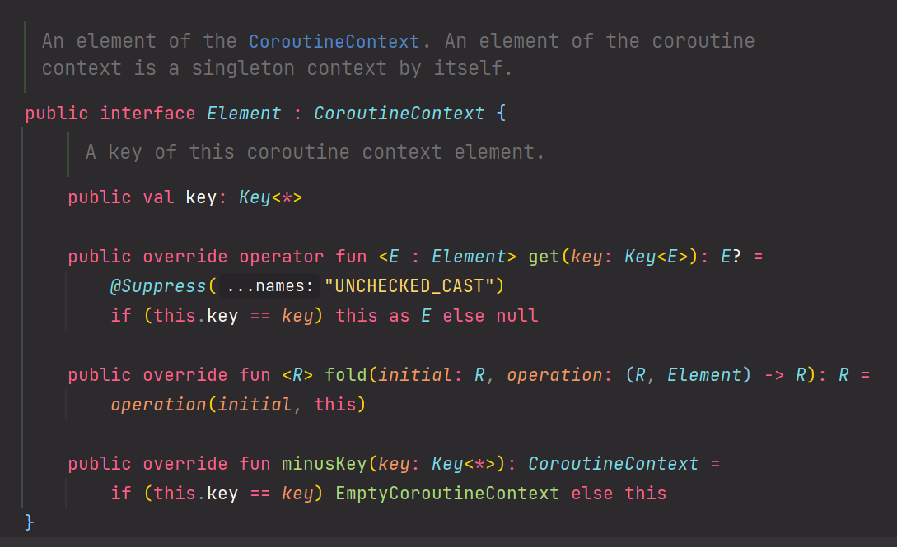
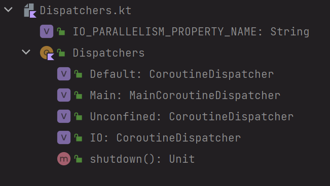
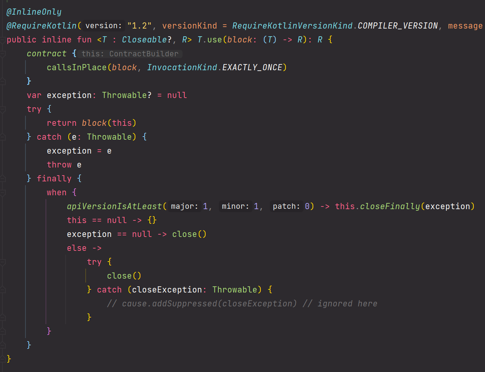
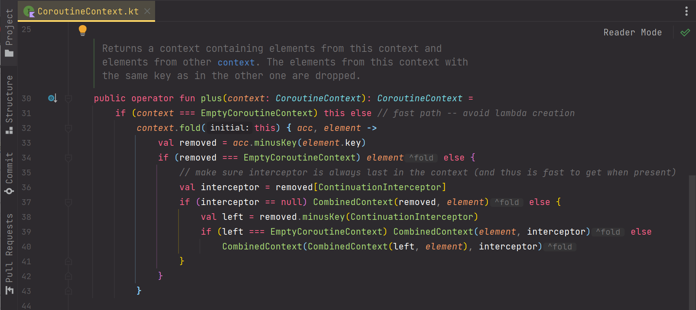

# 새차원-강의요약-6.Coroutine Context and Dispatchers

이번 강의는 그대로 내용을 요약하지 않고, 내 의견을 섞어서 의역하듯이 정리했다. 그대로 받아서 적기엔 주관적으로 해석하거나 요약해야 하는 내용들이 많아서였다.

<br>


### 참고자료

[새차원 코틀린 코루틴 - 6.Coroutine Context and Dispatchers](https://www.youtube.com/watch?v=0uIrl47bSTA)

<br>


### Coroutine Context

> 강의 내용에서 약간은 대본없이 진행하는 듯한 강의이기에 다른 곳으로 빠지거나 하는 등의 부분이 있어서 조금은 수정이 필요한 내용이 필요했는데, 고치다보니 결국 내 의견대로 수정하는게 맞겠다 싶었다. 그래서 이번 `Coroutine Context` 는 강의 내용을 배제한 내 의견만 다뤘다.

<br>


코루틴은 항상 실행 될 때 Coroutine Context 안에서 실행된다.<br>

이 Coroutine Context 라는 것은 **실행문맥** 이라고 생각하면 된다.<br>

실행 문맥이라는 것은 무엇일까?

스레드 프로그래밍에서도 간혹 '컨텍스트 스위칭'이라는 용어를 사용한다. '컨텍스트 스위칭'이란 운영체제가 현재 실행하는 스레드를 다른 스레드로 변경하는 것을 의미하는데, 쉽게 설명해서 현재 실행되는 문맥(컨텍스트)을 교체(스위칭)한다는 의미다. 운영체제에서 문맥이라는 것은 보통 스레드를 의미한다. 어떤 스레드가 실행될 때 스레드 안에서 가지고 있는 변수, 계산된 값들은 보통 하나의 문맥처럼 여겨진다. 

> 문맥이라는 단어는 다소 문과적인 단어다. 내 경우는 학생시절 처음 스레드가 뭔지를 배울 때 억지로 왜 문과적인 단어를 끼워넣었는지 하면서 궁금했던 적이 있다. 소설이나 시 이런게 떠올라서 당최 이해가 안갔었기 때문이다. '문맥'이라는 이름을 지은 이유는 아마도 인간의 언어로 스레드가 가지고 있는 실행 중의 프로그램 환경을 표현하는 것은 '문맥'이라는 단어 외에는 쉽지 않아서 인 듯 싶다.

<br>

코루틴 입장에서 컨텍스트는 무엇일까?

코루틴은 스레드 하나 안에서 실행되는 작은 루틴이다. 코루틴 입장에서 실행되는 문맥은 스레드다. 스레드 안에서 코루틴은 스위칭이 발생할 수 있다. 그래서 코루틴이 실행되는 환경, 즉, 문맥인 CoroutineContext 는 스레드임을 내포하고 설명되는 경우가 꽤 많다.<br>

따라서 앞으로 코루틴 컨텍스트에 대해 설명할 때 코루틴 컨텍스트 = 스레드 로 동일시 해서 정리할 예정이다.

e.g. 

코루틴 컨텍스트를 Dispatchers 내에 미리 선언되어 있는 CoroutineContext 로 지정해서 실행하는 예

```kotlin
val jobA = CoroutineScope(Dispatchers.IO).async {
    // ...
}

val jobB = CoroutineScope(Dispatchers.IO).async {
    // ...
}

runBlocking {
    jobA.await()
    jobB.await()
}
```

<br>


e.g. 

coroutineScope 라는 이름의 코루틴 빌더를 사용해서 코루틴을 실행

```kotlin
suspend fun failedConcurrentSum(): Int = coroutineScope {
    val one = async<Int> { ... }
    val two = async<Int> { ... }
    
    one.await() + two.await()
}
```

<br>


### Dispatcher

Dispatcher 는 Coroutine Context 를 구성하는 요소들 중 하나다.

Dispatcher 는 Coroutine 이 실행될 스레드/스레드 풀을 선택하는 역할을 한다.

**Coroutine 생성**<br>

Coroutine 객체는 코루틴 빌더 또는 코루틴 생성자로 생성 가능한데, 이때 파라미터로 Dispatcher를 명시해줘도 되고 Dispatcher를 지정하는 것을 생략해도 된다. 코루틴 빌더는 항상 옵셔널로 CoroutineContext 라는 파라미터를 갖는다. 따라서 코루틴 빌더를 사용할 때 Dispatcher 를 명시적으로 지정해주는 것은 의무사항이 아니다.

<br>


**Coroutine 실행 & Coroutine Context**<br>

Coroutine 은 Coroutine Context 에서 실행된다. 이 Coroutine Context 는 직접 생성해서 넘겨줘도 되고 Dispatcher 를 지정해주는 것 역시 가능하다. Dispatcher 는 Coroutine 을 어떤 스레드에서 실행할지, 어떤 스레드 풀에서 실행될 지를 결정하는 역할을 수행한다.<br>

멀티 스레드 프로그래밍을 통해 애플리케이션의 성능을 높이려다 보면 결국 스레드 풀을 사용하게 되는데 Java 의 경우 ExecutorService와 Executors 프레임워크를 사용한다. 이런 개념처럼, 코루틴에서는 코루틴을 스레드에 분배하거나 관리할 때 Dispatchers 를 통해 코루틴을 관리한다. 

즉, Coroutine 이 실행될 스레드/스레드 풀을 선택하는 역할을 하는 것이 Dispatcher 의 역할이다.<br>

<br>


**Dispatcher 는 뭐지? CoroutineContext 는?**<br>

Dispatcher 와 코루틴컨텍스트가 뭔지 혼동될 수 있다. 결론적으로는 Dispatcher 는 CoroutineContext  객체의 한 종류다. Dispatcher 클래스의 상속관계를 끝없이 따라가보면, 결국 조상 객체로 Element 클래스 가 나타나고, Element 이 Element 는 결국 CoroutineContext 를 상속받는다.



<br>

Dispatcher 는 여러가지 종류가 있다. 여러가지 자주 쓰이는 용도들에 따라 대표적인 케이스(IO/Main,Unconfined, Default) 들에 특화된 CoroutineContext 객체를 내부적으로 생성해서 상수처럼 사용할 수 있도록 public 으로 제공하고 있다.



<br>

Java 를 예로 들면 Executors 프레임워크를 사용하다보면 newFixedThreadPool, newCachedThreadPool 등의 메서드를 제공하는 것처럼 코루틴의 CoroutineContext 역시 정형화된 4가지의 디스패처가 빌트인으로 제공된다.

<br>


#### Dispatchers and Threads

##### e.g. 기본 예제

```kotlin
package io.gosgjung.study.kotlincoroutine.sachawon.ch06

import kotlinx.coroutines.Dispatchers
import kotlinx.coroutines.launch
import kotlinx.coroutines.newSingleThreadContext
import kotlinx.coroutines.runBlocking


fun main() = runBlocking<Unit> {
    // 1)
    launch { 
        println("main run Blocking : I'm working in thread ${Thread.currentThread().name}")
    }

    // 2)
    launch (Dispatchers.Unconfined){
        println("Unconfined : I'm working in thread ${Thread.currentThread().name}")
    }

    // 3)
    launch (Dispatchers.Default){
        println("Default : I'm working in thread ${Thread.currentThread().name}")
    }

    launch (newSingleThreadContext("MyOwnThread")){
        println("newSingleThreadContext: I'm working in thread ${Thread.currentThread().name}")
    }
}

```

<br>

1\)

- launch 라는 코루틴 빌더를 사용했다. Dispatcher를 명시하지 않고 launch 코루틴 빌더를 사용했다.
- 이 경우 자신을 호출한 CoroutineScope 를 상속받아서 사용한다.
- 즉, 위의 예제에서는 main 을 실행하는 스코프인 `runBlocking<Unit> {...}` 을 코루틴 스코프로 해서 실행되게 된다. 

2\)

- launch 라는 코루틴 빌더에 Dispatchers.Unconfined 라는 디스패처를 전달해줬다. Dispatcher 역시 결국은 본질은 CoroutineContext 객체다. 

3\)

- launch 라는 코루틴 빌더에 Dispatchers.Default 라는 디스패처를 전달해줬다. 

4\)

- launch 라는 코루틴 빌더에 newSingleThreadContext 를 직접 생성해서 전달해줬다.

<br>


실행결과

```plain
Unconfined : I'm working in thread main // 2)
Default : I'm working in thread DefaultDispatcher-worker-1 // 3)
main run Blocking : I'm working in thread main // 1)
newSingleThreadContext: I'm working in thread MyOwnThread // 4)
```

1\)

- 코루틴 빌더 launch {...} 에 Dispatcher 를 지정하지 않은 출력문에서는 `main` 스레드에서 출력문이 실행된 것을 확인할 수 있다.

2\)

- Dispatchers.Unconfined 를 CoroutineContext 로 지정해서 실행한 출력문에서는 `main` 스레드에서 실행하는 것임을 확인 가능하다.

3\)

- Dispatchers.Default 를 CoroutineContext 로 지정해서 실행한 출력문에서는 `DefaultDispatcher-worker-1` 이라는 스레드에서 실행하는 것임을 확인 가능하다.
- Dispatchers.Default 는 GlobalScope 에서 실행하던 코루틴 스코프와 비슷한 역할을 한다.

4\)

- newSingleThreadContext() 를 통해 CoroutineContext를 지정해서 실행한 출력문에서는 "MyOwnThread" 라고 이름을 붙인  이름의 스레드에서 실행되고 있음을 확인 가능하다.
- newSingleThreadContext() 는 스레드 한개에서 코루틴 하나를 실행하는 매우 부유하고 뚱뚱한 스레드 컨텍스트다.

<br>


위에서 사용한 newSingleThreadContext() 다소 비효율 적인 방식이다. 따라서 아래와 같이 use 함수에서 사용하는 것이 좋다.

왜냐하면 use() 함수에서는 내부적으로는 실행이 종료된 다음 close () 하는 처리를 수행하기 때문이다.

```kotlin
fun main = runBlocking<Unit> {
    
    // ... 
    
    newSingleThreadContext("MyOwnThread").use {
        launch (it){
            println("newSingleThreadContext: I'm working in thread ${Thread.currentThread().name}")
        }
    }
}
```


use() 함수는 실제로 Closeable.kt 안에 아래와 같이 정의되어 있다. 

자세히 보면 finally 구문 안에서 명시적으로 close() 처리를 하는 것을 확인할 수 있다.



<br>


### Debugging

`kotlinx.coroutines` 패키지는 debugging 을 쉽게 만들어주는 기능들을 포함하고 있다.<br>

JVM 옵션으로 `-Dkotlinx.coroutines.debug` 옵션을 추가하면 디버깅이 가능해진다.<br>

`-Dkotlinx.coroutines.debug` 옵션을 주면 스레드 이름을 출력할 때 어떤 코루틴에서 쓰이는지도 확인할 수 있다.<br>


e.g.

```kotlin
package io.gosgjung.study.kotlincoroutine.sachawon.ch06

import kotlinx.coroutines.async
import kotlinx.coroutines.runBlocking

fun main() = runBlocking<Unit>{
    val a = async {
        println("I'm computing a piece of the answer")
        6
    }

    val b = async {
        println("I'm computing another piece of the answer")
        7
    }

    println("The answer is ${a.await() + b.await()}")
}
```

 <br>


디버깅 옵션을 따로 추가하지 않은 상태에서의 위의 예제에 대한 출력결과는 아래와 같다.

```plain
[main] I'm computing a piece of the answer
[main] I'm computing another piece of the answer
[main] The answer is 13
```

<br>


디버깅 옵션을 추가한 후의 출력결과는 아래와 같다.

`-Dkotlinx.coroutines.debug` 옵션을 주면 스레드 이름을 출력할 때 어떤 코루틴에서 쓰이는지도 확인할 수 있다.

```plain
[main] I'm computing a piece of the answer
[main] I'm computing another piece of the answer
[main] The answer is 13
```

<br>


### withContext - Jumping Between CoroutineContext 

코루틴 컨텍스트 ctx1, ctx2 가 중첩되어 있을 때 ctx2 에 대한 스코프에서 특정 동작을 수행하는 도중 ctx1 에 대한 컨텍스트로 이동해서 특정 동작을 수행하고 싶을때가 있다. 이런 경우 `withContext()` 라는 함수를 사용한다.

코루틴을 여러개 실행시키다보면 코루틴 컨텍스트가 여러 개의 코루틴 컨텍스트에서 실행되는 것이 많아질 때가 있다. 또한 하나의 코루틴 컨텍스트에서 뭔가를 실행하다가 다른 코루틴 컨텍스트로 진입해서 뭔가를 처리할 때 withContext() 함수를 사용한다.

withContext(ctx) 함수에는 코루틴이 실행될 코루틴 컨텍스트를 명시적으로 지정할 수 있다.

```kotlin
package io.gosgjung.study.kotlincoroutine.sachawon.ch06

import kotlinx.coroutines.newSingleThreadContext
import kotlinx.coroutines.runBlocking
import kotlinx.coroutines.withContext


fun main() {
    fun log(msg: String) = println("[${Thread.currentThread().name}] $msg")

    newSingleThreadContext("ctx1").use{ ctx1 ->
        val aa = 1
        newSingleThreadContext("ctx2").use{ ctx2 ->
            val bb = 2
            runBlocking (ctx1) {
                log("ctx1 에서 실행했습니다. aa = ${aa}")

                // ctx1 내에서 ctx2 컨텍스트로 스위칭한 후 ctx2의 컨텍스트로 원하는 작업을 실행
                withContext(ctx2) {
                    log("ctx2 에서 실행중이지요. bb = ${bb}")
                }

                log("다시 ctx1 로 돌아왔어요. aa = ${aa}")
            }
        }
    }
}
```

<br>


위의 예제를 `-Dkotlinx.coroutines.debug` 옵션을 주어서 실행시킨 결과는 아래와 같다. 

```plain
[ctx1 @coroutine#1] ctx1 에서 실행했습니다. aa = 1
[ctx2 @coroutine#1] ctx2 에서 실행중이지요. bb = 2
[ctx1 @coroutine#1] 다시 ctx1 로 돌아왔어요. aa = 1
```

<br>


실행된 코루틴은 `@coroutine#1` 하나인데 실행되고 있는 컨텍스트 즉, 스레드는 ctx1, ctx2 이렇게 두 개이다. 코루틴이 스레드를 선택하면서 옮겨다니며 실행됐다는 점에 주목하자

<br>


### 코루틴 스코프가 가지는 Job 객체, isActive 확장 프로퍼티

코루틴의 컨텍스트는 Job 객체 역시 가지고 있는다. Job 객체는 코루틴 스코프 내에서 `coroutineContext[Job]` 이라는 표현식으로 바로 접근할 수 있다. 또한 `isActive` 라는 확장 프로퍼티 역시 코루틴 스코프 내에서 바로 접근 가능하다.

<br>

e.g.

```kotlin
package io.gosgjung.study.kotlincoroutine.sachawon.ch06

import kotlinx.coroutines.*

fun main() = runBlocking<Unit> {
    println("My job is ${coroutineContext[Job]}")

    launch{
        println("My job is ${coroutineContext[Job]}")
    }

    async {
        println("My job is ${coroutineContext[Job]}")
        println("isActive ? ${isActive}")
        println("isActive ? ${coroutineContext[Job]?.isActive}")
    }

}
```

<br>


**코루틴 스코프 내의 `coroutineContext`, `isActive`**<br>

코루틴 스코프 내에서 별도의 객체 선언 없이 `coroutineContext[Job]` , `isActive` 라는 프로퍼티를 접근할 수 있는 것으로 유추해보면, 코루틴 빌더(runBlocking, launch, async, ...)내에서 생성된 코루틴 스코프 내에서는 coroutineContext, isActive 에 바로 접근 가능하다는 점을 알 수 있다.

<br>


**코루틴 컨텍스트인 `coroutineContext` 의 구성요소인 `Job`**<br>

또한 코루틴 스코프 프로퍼티인 `coroutineContext` 변수에 대해 `coroutineContext[Job]` 과 같이 Job 이라는 요소로 접근 가능한 것으로 미루어보아 CoroutineContext 는 Job 을 구성요소로 가지고 있다는 것 역시 파악할 수 있다.

<br>


### 부모/자식 관계의 코루틴 실행/취소 - Children of coroutine

새롭게 생성되는 코루틴은 부모 코루틴의 Job 의 자식이다. 코루틴 Job 들은 계층(hieararchy)구조를 가지고 있고 이 계층 구조를 기반으로 실행이 가능하다.

단, GlobalScope 에서 실행되는 코루틴은 예외의 경우다. GlobalScope 에서 실행되는 코루틴은 부모가 없다.  

e.g.

```kotlin
package io.gosgjung.study.kotlincoroutine.sachawon.ch06

import kotlinx.coroutines.GlobalScope
import kotlinx.coroutines.delay
import kotlinx.coroutines.launch
import kotlinx.coroutines.runBlocking

fun main() = runBlocking {
    val request = launch {
        // 1)
        GlobalScope.launch {
            println("job1: I run in GlobalScope and execute independently!")
            delay(1000)
            println("job2: I am not affected by cancellation of the request")
        }
        
        // 2)
        launch{
            delay(100)
            println("Job2: I am a child of the request coroutine")
            delay(1000)
            println("Job2: I will not execute this line if my parent request is cancelled")
        }
    }

    delay(500)
    request.cancel() // 3)
    delay(1000)
    println("main: Who has survived request cancellation?")
}
```

<br>


1\)

- GlobalScope 에서 코루틴을 launch 한다.
- 1초를 딜레이를 주었다.
- 3\) 에서 cancel() 시에 영향을 받지 않는다. GlobalScope는 부모 스코프와는 별개로 동작하기 때문이다.

2\)

- 부모 스코프를 물려받아서 새로운 코루틴을 실행한다.
- 1초를 딜레이를 주었다.
- 3\) 에서 cancel() 시에 영향을 받는다. 따라서 가장 아래에서 출력하려고 하는 `Job2: I will not execute this line if my parent request is cancelled` 은 출력되지 않는다.

3\) 

- 1\) 2\) 에서 실행중인 job 을 cancel() 시켜 본다.
- 1\) 에서 실행하는 GlobalScope 기반의 코루틴은 부모 스코프가 캔슬되도 마이웨이로 혼자서 멋대로 실행된다.


출력결과

```plain
job1: I run in GlobalScope and execute independently!
Job2: I am a child of the request coroutine
job2: I am not affected by cancellation of the request
main: Who has survived request cancellation?
```

<br>


### Parental Responsibilities

예전에 정리했던 hieararchial scope 와 비슷한 개념이다.

부모 코루틴은 모든 자식 코루틴의 동작이 종료될 때 까지 기다려준다.

모든 자식 코루틴에 대해 명시적으로 Job.join() 을 통해 tracking 하지 않아도 된다.

```kotlin
package io.gosgjung.study.kotlincoroutine.sachawon.ch06

import kotlinx.coroutines.delay
import kotlinx.coroutines.launch
import kotlinx.coroutines.runBlocking

fun main() = runBlocking<Unit> { // 1)
    val request = launch{ // 2)
        repeat(3) { i ->
            launch { // 3)
                delay((i+1) * 200L)
                println("Coroutines $i is done")
            }
        }
        println("request : I'm done and I don't explicitly join my children that are still active")
    }

//    request.join()
    println("Now processing of the request is complete")
}

```

<br>

코루틴 2\) 는 코루틴 3\) 이 끝날 때까지 기다려준다.

코루틴 1\) 은 코루틴 2\) 가 끝날 때까지 기다려준다.

<br>


위의 예제의 출력결과는 아래와 같다.

```plain
Now processing of the request is complete
request : I'm done and I don't explicitly join my children that are still active
Coroutines 0 is done
Coroutines 1 is done
Coroutines 2 is done
```

<br>


만약 순차적으로 print() 를 하고 싶다면 join() 을 사용하면 된다.

만약 코루틴 스코프에서 실행하지 않고 개별 스레드로 흘려서 1\), 2\), 3\) 을 실행했을 경우 3\) 이 끝날 때 까지 main 스레드가 기다려주지 않았을 가능성이 크다.

<br>


### Combining Context Element

코루틴 엘리먼트를 합쳐서 하나로 만들어보기

Dispatcher, CoroutineScope, CoroutineName 과 같은 코루틴 컨텍스트를 합쳐서 새로운 코루틴 컨텍스를 만들려 한다면, + 연산자를 쓰면 된다.

e.g.

```kotlin
package io.gosgjung.study.kotlincoroutine.sachawon.ch06

import kotlinx.coroutines.CoroutineName
import kotlinx.coroutines.Dispatchers
import kotlinx.coroutines.launch
import kotlinx.coroutines.runBlocking

fun main() = runBlocking<Unit> {
    launch(Dispatchers.Default + CoroutineName("test")) {
        println("I'm working in thread ${Thread.currentThread().name}")
    }
}
```


출력결과

```plain
I'm working in thread DefaultDispatcher-worker-1
```


위에서 사용한 `+` 연산자를 IDE의 코드 검색 기능을 이용해서 정의부로 이동하면 아래와 같은 코드를 볼수 있다.

코드 검색기능에서 알려준 소스는 내부 라이브러리 소스인 CoroutineContext.kt다.




자세히 보면 fold(..){...} 을 통해서 reduction 을 수행하고 있는데, 주요 로직이 대부분 EmptyCoroutineContext 가 아닐 경우에 대해 else 구문으로 CombinedContext(CombinedContext(left, element), intercepter) 를 호출하고 있음을 확인 가능하다.

<br>


### Coroutine Scope

안드로이드의 특정 Activity 에서 200 ms 마다 한번씩 특정 문구를 출력하는 작업을 코루틴을 이용해서 10회 수행하고 있었다고 해보자. 이때 중간에 취소버튼을 눌러서 나와야 한다면? 이미 실행중인 문구 출력을 하는 코루틴을 취소를 해줘야 백그라운드에서도 회수를 해올 수 있다. 만약 취소를 하지 않는다면 뒷단에서 코루틴이 계속 돌게 된다. (메모리 릭)

예로 든 예제는 단순히 코루틴을 기다리는 예제여서 다소 중요해보이지 않을수도 있겠지만, 뭔가 계산을 하거나 이런 작업을 하는 경우들이라면 코루틴을 cancel() 하는 것은 중요할 수 있다.

```kotlin
package io.gosgjung.study.kotlincoroutine.sachawon.ch06

import kotlinx.coroutines.*

class Activity{
    private val mainScope = CoroutineScope(Dispatchers.Default)

    fun destroy(){
        mainScope.cancel()
    }

    fun doSomething(){
        repeat(10){ i ->
            mainScope.launch {
                delay((i+1) * 200L)
                println("Coroutine $i is done")
            }
        }
    }
}

fun main() = runBlocking<Unit> {
    val activity = Activity()
    activity.doSomething()
    println("Launched coroutines")
    delay(500L)
    println("Destroying activity!")
    activity.destroy()
    delay(1000L)
}
```

<br>


출력결과

```plain
Launched coroutines
Coroutine 0 is done
Coroutine 1 is done
Destroying activity!
```

<br>


출력결과는 10번의 출력문을 수행하는 도중에 destroy() 가 발생했을 때 해당 코루틴을 정확하게 회수하고 종료시켰음을 확인할 수 있다.

<br>

만약 destroy() 를 호출하지 않는다면, main 문이 종료된 후에도 코루틴 스코프는 계속 남아있기에 계속해서 실행되면서 10번의 출력문을 끝까지 출력하게 되어버린다. (메모리 릭 발생)<br>

<br>


