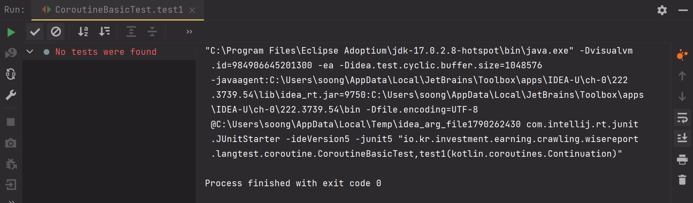
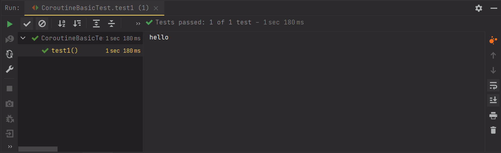

# 코루틴 Junit (1) - 코루틴 함수를 테스트 코드에서 단순실행해보기

코루틴 함수를 테스트 코드에서 단순 실행하는 방법을 정리해보기로 했다.

오늘 정리하는 내용은 굉장히 단순한 코드이긴 하다...

먼저 아래와 같은 코드가 있다고 해보자.


**HelloMessage.kt**

```kotlin
import kotlinx.coroutines.delay

class HelloMessage {

    companion object{
        suspend fun en(){
            delay(1000)
            println("hello")
        }
    }
}
```

<br>


그리고 `HelloMessage.en()` 메서드를 실행하는 테스트코드는 아래와 같다고 해보자.

<br>

**CoroutineBasicTest.kt**<br>

```kotlin
import org.junit.jupiter.api.Test

class CoroutineBasicTest {

    @Test
    fun test1() {
        HelloMessage.en() // 여기서 컴파일러가 컴파일에러를 가리킨다.
        
    }

}
```


인텔리제이에서 안내하는 대로 suspend 키워드를 붙이면 어떻게 될까?

```kotlin
import org.junit.jupiter.api.Test

class CoroutineBasicTest {

    @Test
    suspend fun test1() {
        HelloMessage.en()
    }

}
```

<br>

출력결과가 아래와 같이 나타난다. 테스트를 찾을수 없다는 메시지를 보게 된다.



<br>


이번에는 runBlocking 을 통해 블로킹되도록 실행해보자.

runBlocking 내에서 실행한다면 코루틴 스코프에서 실행하는 것이기에 잘 될 듯하다.

```kotlin
import kotlinx.coroutines.runBlocking
import org.junit.jupiter.api.Test

class CoroutineBasicTest {

    @Test
    fun test1() {
        runBlocking {
            HelloMessage.en()
        }
    }

}
```

<br>

출력결과가 아래 캡처 처럼 잘 되는 것을 볼수 있다.




