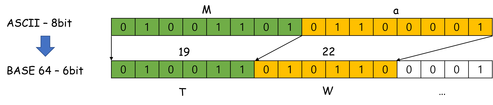
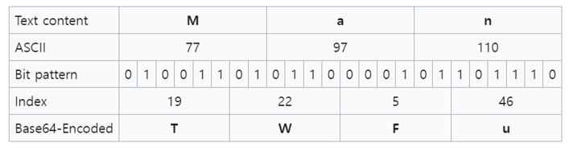
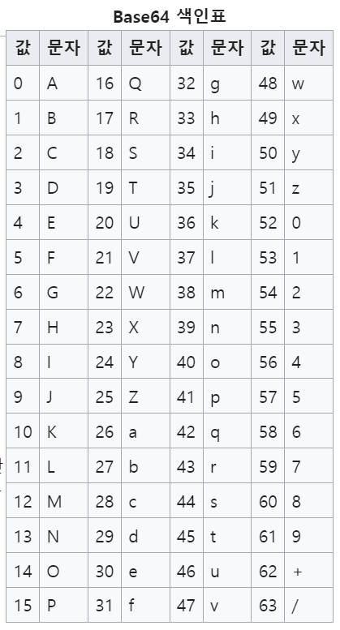

# Base64 인코딩

java 코드로도 예제를 만들어볼 예정이다.

<br>


### 참고

- [ko.wikipedia.org/wiki/베이스64](https://ko.wikipedia.org/wiki/%EB%B2%A0%EC%9D%B4%EC%8A%A464)

<br>


### base64 란?

ascii 코드는 128개의 문자로 이루어진다. ascii 코드는 8비트다. (최상위 비트는 패리티 비트다.)

이 중 화면에 표시할 수 있는 ASCII 문자들을 64개만 선택해서 변환하는 인코딩방식을 Base 64 인코딩이라고 한다.

쉽게 설명하면 이렇다.

- '+', '/' 를 모든 특수문자를 제거한 알파벳 만으로 구성된 문자열을 만들어내는 인코딩이다.
- 특수문자를 제거하는 이유는, 제어문자가 섞여있는 경우도 있을 수 있기 때문이다.
- 인코딩된 문자열의 가장 마지막은 `=` 으로 인코딩 문자열의 끝을 표시한다.<br>

 <br>


### e.g. base 64 인코딩 적용 전/후

base 64 인코딩을 거치면 아래와 같이 문장이 변화된다.

인코딩 적용 전의 문장

```plain
Man is distinguished, not only by his reason, but by this singular passion from other animals, which is a lust of the mind, that by a perseverance of delight in the continued and indefatigable generation of knowledge, exceeds the short vehemence of any carnal pleasure.
```

<br>


인코딩 적용 후의 문장

```plain
TWFuIGlzIGRpc3Rpbmd1aXNoZWQsIG5vdCBvbmx5IGJ5IGhpcyByZWFzb24sIGJ1dCBieSB0
aGlzIHNpbmd1bGFyIHBhc3Npb24gZnJvbSBvdGhlciBhbmltYWxzLCB3aGljaCBpcyBhIGx1
c3Qgb2YgdGhlIG1pbmQsIHRoYXQgYnkgYSBwZXJzZXZlcmFuY2Ugb2YgZGVsaWdodCBpbiB0
aGUgY29udGludWVkIGFuZCBpbmRlZmF0aWdhYmxlIGdlbmVyYXRpb24gb2Yga25vd2xlZGdl
LCBleGNlZWRzIHRoZSBzaG9ydCB2ZWhlbWVuY2Ugb2YgYW55IGNhcm5hbCBwbGVhc3VyZS4=
```

<br>


### 인코딩 과정

위의 예를 보듯이 아스키 코드를 Base 64 인코딩하면 문자열의 갯수가 늘어난다. 



<br>

- 아스키 숫자를 6비트 단위로 묶어서 10진수 숫자로 산출하고

- 산출된 10진수 숫자는 base 64 에 정의한 숫자-문자 표를 참조해서 10진수 숫자에 해당하는 문자열로 변환하는 과정을 거친다.

<br>


인코딩 과정을 그림으로 표현해보면 아래와 같다.



<br>


10진수 0 \~ 63 에 대응하는 Base 64 문자코드를 매핑해놓은 테이블은 아래와 같다.<br>

e.g. 위에서 19 라는 숫자는 'T'로 변환되었고, 22 라는 숫자는 'W'로 변환되었다.<br>



<br>


### kotlin

예제 용도이기에 리팩토링은 하지 않고, 최대한 단순한 코드로 작성했다!!

> 예제코드 링크
>
> - 같은 이름의 프로젝트가 여러 개의 깃헙/깃랩 계정에  있어서... 엉뚱한 프로젝트에 코드를 작성해서 커밋,푸시 했었다.
> - 따로 프로젝트를 파는 등의 조치를 취해서 정리되는 대로 링크 추가 예정


```kotlin
class Base64EncodingTest {
    val base64Str = "ABCDEFGHIJKLMNOPQRSTUVWXYZabcdefghijklmnopqrstuvwxyz0123456789+/"
    
    fun toBinaryString(input: String) : String{
        return input.toCharArray()
            .map { String.format("%8s", Integer.toBinaryString(it.code)).replace(' ', '0') }
            .fold(""){ acc, str ->
                acc + str
            }
    }
    
    @Test
    @DisplayName("Base64 코드 변환")
    fun convert_to_base64(){
        val INPUT: String = "Man"
        val binaryString = toBinaryString(INPUT)

        val base64List = binaryString.chunked(6)
            .map{ Integer.parseInt(it, 2) }
            .toList()

        assertThat(base64List, contains(19,22,5,46))

        val target = base64List
            .fold(""){acc, code ->
                acc + base64Str[code]
            }

        assertThat(target, equalTo("TWFu"))
    }
}
```

<br>


### Java


